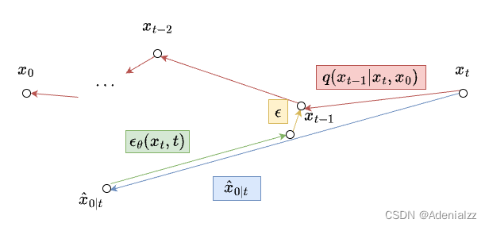
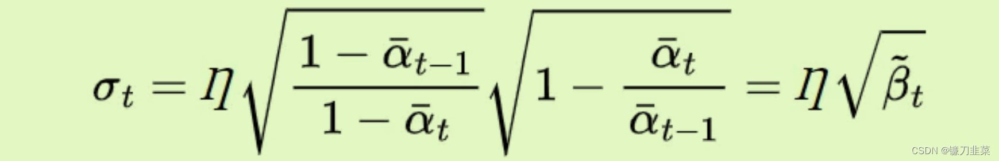

## DDIM 作用
DDPM需要一步一步去噪，在训练后生成图像的速度很慢。而DDIM**允许跳过去噪过程中的步骤**，而不需要在当前状态之前访问所有过去的状态。

## DDIM 原理
### DDPM：
前向过程：

反向过程：

其中，
在反向过程中，$x_0$是未知的，需要在每步对$x_0$进行估计。
反向过程需要做两件事：
1.**估计$\hat{x}_{0|t}$**:
$$\hat{x}_{0|t}=\frac{1}{\sqrt{\bar{\alpha}_t}}(x_t-\sqrt{1-\bar\alpha_t}\epsilon_\theta(x_t,t)) $$
2.计算$x_{t-1}$:
$$ x_{t-1}=\mu(x_t,\hat{x}_{{0|t}})+\sigma_t\epsilon,\ \ \ \ \epsilon\sim\mathcal{N}(0,I)x $$

### DDIM：

DDIM 丢掉了 DDPM 中的一个条件 $q(x_t|x_{t-1})$，可以进行跳步采样，得到了更通用的 DDIM 的采样公式：

该公式可以实现了**从任意步k到任意步s的跳步采样**。

#### 理解DDIM的两个视角
**训练目标角度：**
而 DDIM 在采样时可以跳步，也就是说 **UNet 只需要具备对某几个时间步的去噪能力就行了**。即：**DDIM 的训练目标是 DDPM 的子集**。

**图示理解的角度：**

第一项 $\sqrt{\bar\alpha_{t-1}}\hat{x}_{0|t}$的意义是当前步对 $ x_0$的估计，乘一个系数（图中蓝色部分）。
第二项 $\sqrt{1-\bar\alpha_{t-1}-\sigma^2_t}\epsilon_\theta(x_t,t) $ 则相当于按照原来的方向又往回走了一段距离（图中绿色部分）
第三项 $\sigma_t\epsilon$则表示在当前到达的位置又加了一个小扰动（图中黄色部分）

$\sigma_t=0$ 时。此时相当于第三项没有了，即没有了小扰动。此时采样的过程就没有随机性了，初始点$x_T$就已经决定了最终结果$x_0$。这样的好处就是$x_T$可以被看做是一个隐变量,可以进行图像插值。

**作者使用以下公式将模型的扩散模型方差确定为DDIM和DDPM之间的插值。**

当$\eta =\odot$时，由于没有噪声，扩散模型是DDIM，当$\eta=1$时，扩散模型为原始DDPM。0和1之间的任何$\etaη$都是DDIM和DDPM之间的插值。

## 学习资源
**公式推导：** https://blog.csdn.net/weixin_44966641/article/details/135210790

