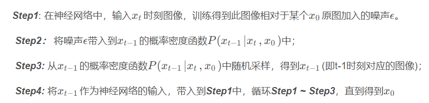

## DDPM作用
在扩散模型流行之前，主要使用生成对抗网络GAN进行图像生成。但是生成网络GAN存在一些缺点，因为其要训练两个网络，难度较大，容易不收敛，多样性较差，并且模型在训练过程中不稳定。而DDPM（Denoising Diffusion Probabilistic Models）是一种基于概率的生成模型，它通过训练一个噪声预测模型来生成图像，该模型可以生成具有**多样性和稳定性**的图像。

## 模型架构

**扩散模型**分为两个阶段，分为**前向过程**和**反向过程**。

### 前向过程(加噪过程)
前向过程又称**扩散过程**，其是一个**马尔科夫过程**(即当前状态只和前一个状态有关)。我们向原始图像$x_0$中逐步添加高斯噪声，噪声的标准差是固定值$\beta_t$ 来确定的，均值是固定值$\beta_t$和$t − 1$ 时刻的数据$x_{t-1}$ 确定的。随着$t$不断增大，最终分布$x_T$服从于各向同性的高斯分布了。一般取T=1000。

在每个时间步，都从正态分布中**随机采样一个和图片等大的噪声**（也可以理解为噪声图片）

​ $\beta_0$ 接近0,$\beta_T$接近1，原因是**越到最后扩散速度越快**。可以理解为**越到后面图片包含的信息越少，可以以更大幅度加噪**。
但一步一步加噪计算成本较大，可根据正态分布性质简化计算：

其中$a_t=1-\beta_t$。
使用上述公式可以只通过**一次采样**就能得到$x_t$

### 反向过程(去噪过程)
在前向过程中，我们从$x_0$中加入噪声后$ϵ$后得到$x_t$.
在反向过程中，我们需要从$x_t$预测出$x_{t-1}$的概率分布，这可以通过下面公式得到。

在该公式中，只有$ϵ$不是常量，所以我们只需要使用一个神经网络来预测加入$x_t$的噪声$ϵ$即可，通常使用UNet来预测该噪声图片。

$x_{t-1}$的概率分布的均值可以通过数学变换改为以下形式，更有利于代码实现：

去噪过程：

代码实现：
~~~
for idx in reversed(range(len(self.alpha_bars))):
    noise = torch.zeros_like(x) if idx == 0 else torch.randn_like(x)
    sqrt_tilde_beta = torch.sqrt((1 - self.alpha_prev_bars[idx]) / (1 - self.alpha_bars[idx]) * self.betas[idx])
    predict_epsilon = self.diffusion_fn(x, idx)
    mu_theta_xt = torch.sqrt(1 / self.alphas[idx]) * (x - self.betas[idx] / torch.sqrt(1 - self.alpha_bars[idx]) * predict_epsilon)
    x = mu_theta_xt + sqrt_tilde_beta * noise
    yield x
~~~

## 学习资源
**code:** https://www.kaggle.com/code/czy111/ddpm-example
**容易理解的推导：** https://blog.csdn.net/qq_41915623/article/details/135142211
**结合代码的介绍：** https://blog.csdn.net/weixin_37817275/article/details/129817654
https://blog.csdn.net/weixin_44791964/article/details/128604816
https://blog.csdn.net/z240626191s/article/details/133933052
https://blog.csdn.net/qq_45752541/article/details/127956235
