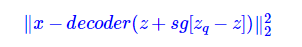

## VQVAE 作用
VQVAE(Vector Quantised - Variational AutoEncoder),能够将各种模态的数据编码为离散的编码向量，能够避免后验坍塌等问题，也更有利于使用自回归模型进行生成。

## 模型架构

VQVAE步骤如下：
1.将图片送入编码器，得到一个编码向量$z_e(x)$,其通道数为$d$.
2.维护一个大小为k的codebook E,$E=[e_1,e_2,e_3,...,e_K]$,这里每个$e_i$都是一个大小为$d$.
2.把图片每个位置各通道值合并为一个向量$z$，计算与E中与z最接近的向量,令$z_q=e_k$.

3.将z_q作为最终的编码结果，送入Decoder,希望重构出原图。

## 损失函数
VQVAE的损失函数由两部分组成：
1.**重构损失**：
在VQVAE中，重构损失为：

但从$z$到$z_q$使用了$argmin$操作，该操作是没有梯度的，故应该对重构损失进行修改，最终重构损失如下：

其中sg是stop gradient的意思，前向传播计算（求loss）的时候，就直接等价于$decoder(z+z_q−z)=decoder(z_q)$，然后反向传播（求梯度）的时候，由于$z_q−z$不提供梯度，所以它也等价于$decoder(z)$，这个就允许我们对encoder进行优化了。
2.离散损失：**根据VQ-VAE的最邻近搜索的设计，我们应该期望$z_q$和z是很接近的（事实上编码表E的每个向量类似各个z的聚类中心出现）**
最终loss如下：

由于编码表（$z_q$）相对是比较自由的，而$z$要尽力保证重构效果，所以我们应当尽量“让$z_q$去靠近$z$”而不是“让$z$去靠近$z_q$”
故$γ<β$，在原论文中使用的是$γ=0.25β$。

