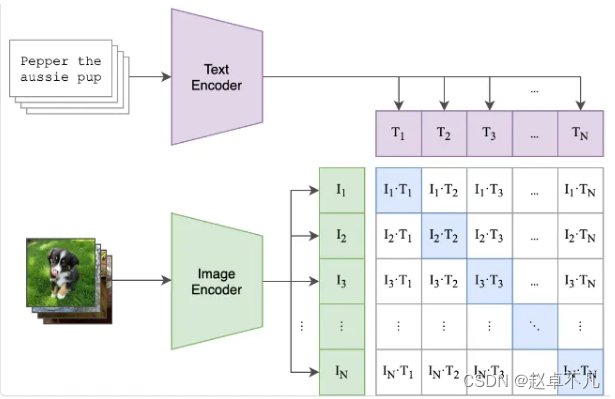
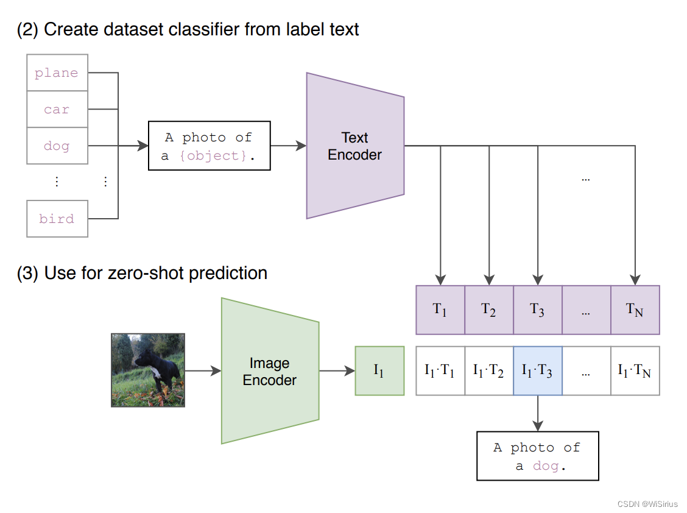

## CLIP作用
CLIP（Contrastive Language–Image Pretraining）是一种预训练模型，旨在通过对比学习的方式同时学习图像和文本的表示。CLIP模型的目标是使图像和文本在嵌入空间中尽可能接近，从而实现**跨模态的关联**。


## CLIP结构

CLIP模型由两部分组成：一个图像编码器和一个文本编码器。图像编码器将输入图像转换为图像嵌入，文本编码器将输入文本转换为文本嵌入。

CLIP模型旨在预测一个batch中N×N个潜在(img,text)配对具体哪些是实际匹配的。为了实现这一点，CLIP通过图像编码器和文本编码器的联合训练建立了一个多模态嵌入空间。
CLIP的损失函数旨在**最大化批处理中N个真实配对的图像和文本嵌入之间的余弦相似性**，**同时最小化N²−N个错误配对的余弦相似度**。以下是伪代码（取自原始论文），概述了CLIP的核心实现。
```
# 分别提取图像特征和文本特征
I_f = image_encoder(I) #[n, d_i]
T_f = text_encoder(T) #[n, d_t]

# 对两个特征进行线性映射，映射到同一向量空间，得到相同维度的特征，并进行l2归一化，使得l2范数为1。
I_e = l2_normalize(np.dot(I_f, W_i), axis=1)
T_e = l2_normalize(np.dot(T_f, W_t), axis=1)

# 计算缩放的余弦相似度：[n, n]
# 因为两向量l2范数都为1，故余弦相似度就是它们点乘
的结果。
logits = np.dot(I_e, T_e.T) * np.exp(t)

# 对称的对比学习损失：等价于N个类别的cross_entropy_loss
labels = np.arange(n) # 对角线元素的labels
loss_i = cross_entropy_loss(logits, labels, axis=0)
loss_t = cross_entropy_loss(logits, labels, axis=1)
loss = (loss_i + loss_t)/2
```

### Zero-shot图像分类

**根据所迁移的数据集将所有类别转换为文本，将需要分类的单个图像输入Image Encoder中，得到这张图像编码后的向量，将该向量与得到的文本特征分别计算余弦相似度**。找出相似度最大的那一个，即可图片进行分类。


## 学习资源
**模型介绍**：https://blog.csdn.net/wisirius/article/details/135659266


