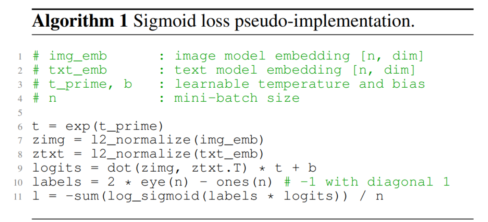
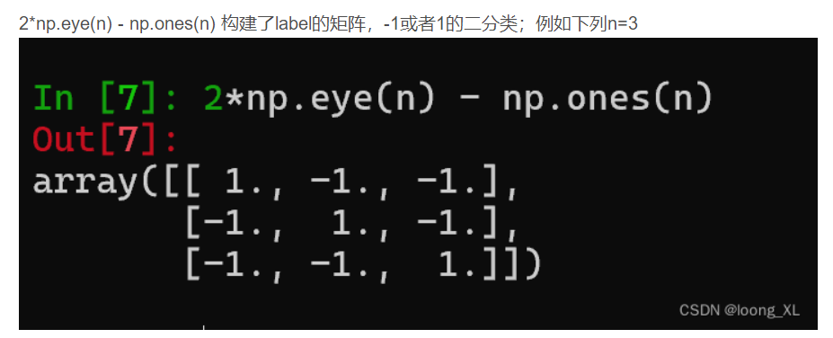
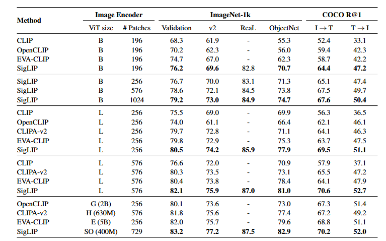

## SigLIP作用
SigLIP提出了一种简单的成对 Sigmoid 损失法。**与使用软最大归一化的标准对比学习不同，sigmoid loss 只对图像-文本对进行操作，而不需要对相似性进行全局归一化**。同时，sigmoid loss 还能进一步扩大批次规模，在批次规模较小的情况下也能发挥更好的效果

## SigLIP原理
在CLIP中，对图文对作多分类，需要全局softmax
SigLIP 的核心思想是，**将图像-文本对视为一个二元分类问题**。

正样本标签1，负样本标签-1.

## 结果
