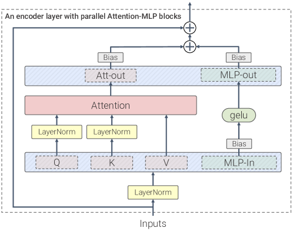
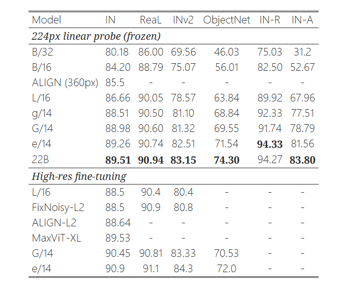
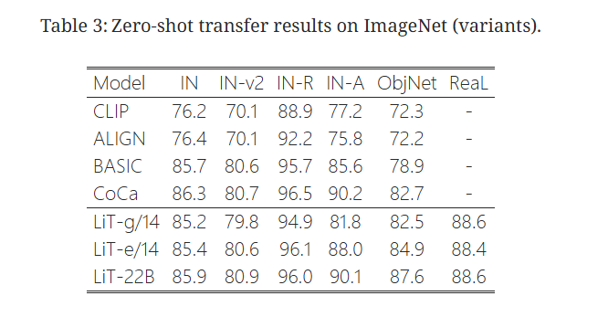

## ViT-22B作用
在将模型参数量扩展到 22B 参数的过程中，作者发现了阻碍扩展**默认配方的病态训练不稳定性**，并展示了使其成为可能的架构变化。
此外，通过精心设计了模型，**使模型并行训练达到前所未有的效率**。

ViT-22B 的质量是通过一套全面的评估任务来评估的，包括从（少量）分类到高密度输出任务，在这些任务中，ViT-22B 达到或超越了当前最先进的水平。


## ViT-22B架构


ViT-22B 与基本ViT的结构相似，但加入了以下三个主要修改，以提高大规模训练的效率和稳定性：
- 并行层
  - **通过结合 MLP 和注意力模块的线性投影实现额外的并行化**。
  - 特别是，查询/键/值投影的矩阵乘法和 MLP 的第一个线性层融合为一个操作，同样的操作也适用于注意力外投影和 MLP 的第二个线性层。
  - PaLM 也采用了这种方法，这种技术将最大模型的训练速度提高了 15%，而性能却没有下降。
- query/key归一化
  - 在扩展 ViT 的过程中，实验发现在几千步之后，训练损失出现了分化。其原因是注意力对数值过大，导致注意力权重（几乎为one-hot向量）的熵值接近于零。为了解决这个问题，采用了**在点积注意力计算之前对查询和键应用LayerNorm**的方法。
- 去除QKV proj和Layer Norm的偏置
  - 按照 PaLM的方法，从 QKV proj中移除bias，并在没有bias和减均值的情况下应用所有 LayerNorms。这提高了加速器的利用率（3%），而质量没有下降。
  - 然而，与 PaLM 不同的是，对（内和外）MLP 密集层使用了偏置项，因为实验观察到质量提高了，速度却没有降低。

## 结果



## code
```
class ParallelTransformerBlock(nn.Module):
    def __init__(self, dim, dim_head=64, heads=8, ff_mult=4):
        super().__init__()
        self.norm = LayerNorm(dim)

        attn_inner_dim = dim_head * heads
        ff_inner_dim = dim * ff_mult
        self.fused_dims = (attn_inner_dim, dim_head, dim_head, (ff_inner_dim * 2))

        self.heads = heads
        self.scale = dim_head**-0.5
        self.rotary_emb = RotaryEmbedding(dim_head)

        self.fused_attn_ff_proj = nn.Linear(dim, sum(self.fused_dims), bias=False)
        self.attn_out = nn.Linear(attn_inner_dim, dim, bias=False)

        self.ff_out = nn.Sequential(
            SwiGLU(),
            nn.Linear(ff_inner_dim, dim, bias=False)
        )

        # for caching causal mask and rotary embeddings

        self.register_buffer("mask", None, persistent=False)
        self.register_buffer("pos_emb", None, persistent=False)

    def get_mask(self, n, device):
        if self.mask is not None and self.mask.shape[-1] >= n:
            return self.mask[:n, :n]

        mask = torch.ones((n, n), device=device, dtype=torch.bool).triu(1)
        self.register_buffer("mask", mask, persistent=False)
        return mask

    def get_rotary_embedding(self, n, device):
        if self.pos_emb is not None and self.pos_emb.shape[-2] >= n:
            return self.pos_emb[:n]

        pos_emb = self.rotary_emb(n, device=device)
        self.register_buffer("pos_emb", pos_emb, persistent=False)
        return pos_emb

    def forward(self, x):
        """
        einstein notation
        b - batch
        h - heads
        n, i, j - sequence length (base sequence length, source, target)
        d - feature dimension
        """

        n, device, h = x.shape[1], x.device, self.heads

        # pre layernorm

        x = self.norm(x)

        # attention queries, keys, values, and feedforward inner

        q, k, v, ff = self.fused_attn_ff_proj(x).split(self.fused_dims, dim=-1)

        # split heads
        # they use multi-query single-key-value attention, yet another Noam Shazeer paper
        # they found no performance loss past a certain scale, and more efficient decoding obviously
        # https://arxiv.org/abs/1911.02150

        q = rearrange(q, "b n (h d) -> b h n d", h=h)

        # rotary embeddings

        positions = self.get_rotary_embedding(n, device)
        q, k = map(lambda t: apply_rotary_pos_emb(positions, t), (q, k))

        # scale

        q = q * self.scale

        # similarity

        sim = einsum("b h i d, b j d -> b h i j", q, k)

        # causal mask

        causal_mask = self.get_mask(n, device)
        sim = sim.masked_fill(causal_mask, -torch.finfo(sim.dtype).max)

        # attention

        attn = sim.softmax(dim=-1)

        # aggregate values

        out = einsum("b h i j, b j d -> b h i d", attn, v)

        # merge heads

        out = rearrange(out, "b h n d -> b n (h d)")
        return self.attn_out(out) + self.ff_out(ff)

```