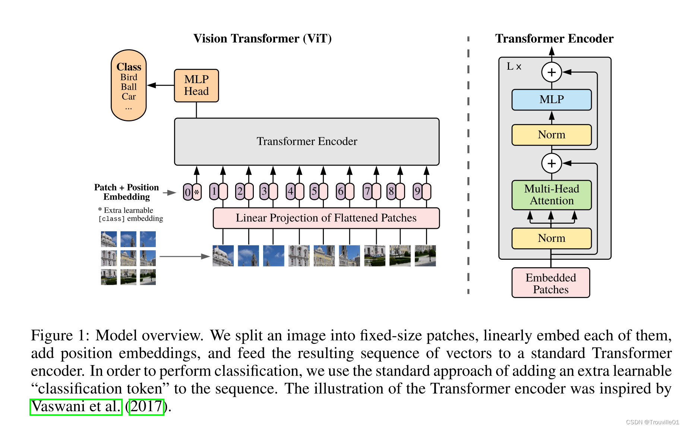
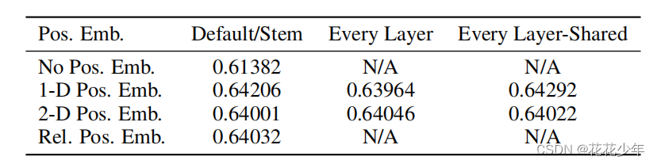

## ViT 作用
**"归纳偏置":** 指的是学习算法在面对可能的假设空间（hypothesis space）时，所做出的关于**哪种假设更可能正确的预先假设或偏好,或者说一种先验知识**。有了这种先验，我们就能知道**哪一种方法更适合解决哪一类任务**。

CNN中的归纳偏置:
- 空间局部性
- 平移不变性
- 二维邻域结构

而在ViT中，只包含前两种归纳偏差，而且在初始化时间的位置嵌入中不包含有关补丁的二维位置的信息，所有补丁之间的空间关系都必须从头开始学习。但在预训练数据够多的情况下，它就能更好地学习像素块之间的关联性。

## ViT 模型结构

### 1.图像特征嵌入模块
- 将输入图像划分为大小为16x16的patch，每个patch被展平为一个长度为768的向量，然后将其输入到Transformer中。

展平方法：采用768个16*16*3尺寸的卷积核，stride=16，padding=0。这样我们就能得到14*14*768大小的特征图。

- Class Embedding:添加cls token
- Position Embedding

不同位置编码方式对结果影响不大
### 2. Transformer Encoder
- 在Transformer中，每个补丁被表示为一个向量，然后通过多头自注意力机制和前馈神经网络进行处理。
- 

### 3. 分类头
- 在Transformer的输出中，每个patch被表示为一个向量，然后通过一个线性层将其映射到目标类别。

## 模型训练
- 需要大量数据才能取得较好效果

## 模型微调
- 可使用torchvision加载预训练权重
- 链接：https://pytorch.org/vision/stable/models.html

## 学习资源
**论文解读**： https://blog.csdn.net/m0_37605642/article/details/133821025
**pytorch实现**：https://blog.csdn.net/FriendshipTang/article/details/137832810
**code**:https://github.com/yangyunfeng-cyber/Useful-DL-Projects-for-Exercise/blob/main/VIT/vit_model.py