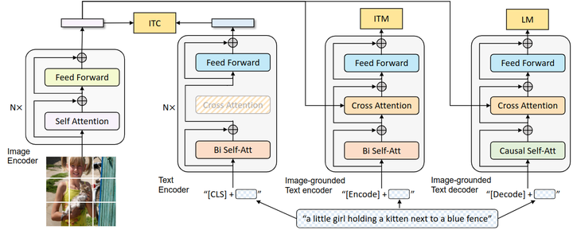
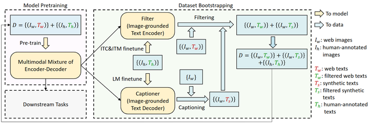
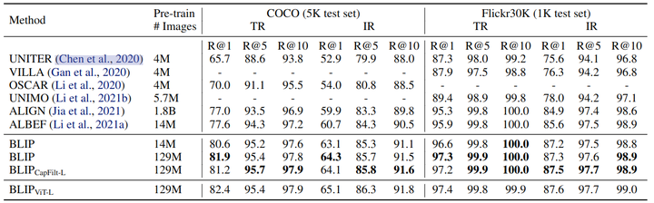
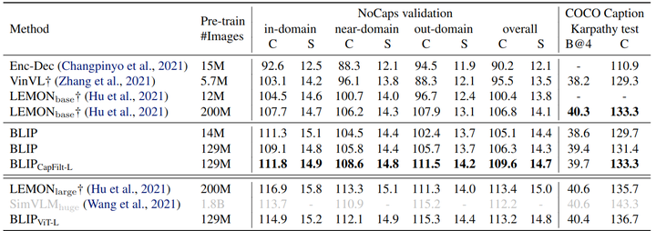
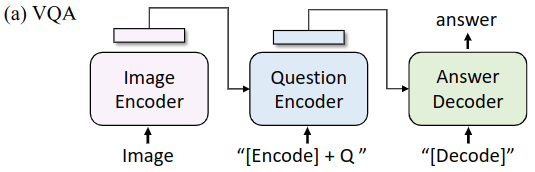
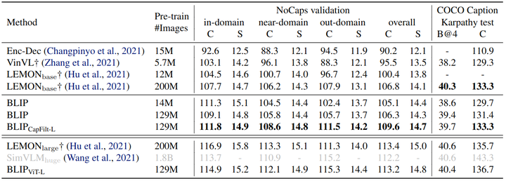
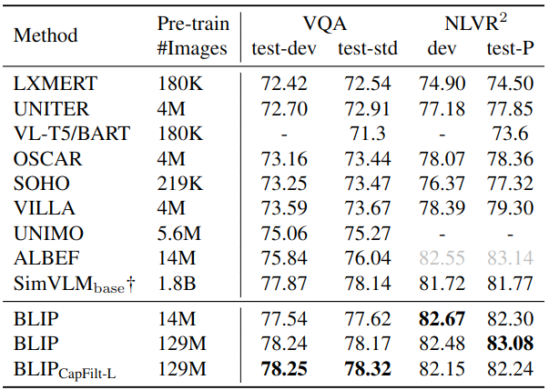
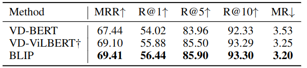

## BLIP(Bootstrapping Language-Image Pre-training)作用
- 从模型角度来看，大多数方法要么采用基于Enocder-only的模型，要么采用decoder-only模型。
  - **Enocder-only模型不太容易直接迁移到文本生成的任务**
  - **decoder-only模型则缺乏对图像内容的理解**。
**BLIP结合了encoder和decoder的优点，以实现对理解任务和生成任务的兼顾**。
  
- 从数据角度来看，大多数sota的方法，如CLIP都是对从网上收集的图像——文本对（image-text pair）进行预训练。尽管可以通过扩大数据集的规模来获得性能上的提高，但研究结果显示，**有噪声的网络文本对于视觉语言学习来说只能得到次优的结果**。
BLIP 提出了一种高效率利用噪声网络数据的方法。**即先使用嘈杂数据训练一遍 BLIP，再使用 BLIP 的生成功能生成一系列通过预训练的 Captioner 生成一系列的字幕，再把这些生成的字幕通过预训练的 Filter 过滤一遍，从原始网络文本和合成文本中删除嘈杂的字幕，得到干净的数据**。最后再使用干净的数据训练一遍 BLIP。

## BLIP模型结构

### 1.视觉编码器：提取图片特征
最左边的是视觉编码器，**就是 ViT 的架构**。将输入图像分割成一个个的 Patch 并将它们编码为一系列 Image Embedding，并使用额外的 [CLS] token 来表示全局的图像特征。视觉编码器不采用之前的基于目标检测器的形式，因为 ViLT 和 SimVLM 等工作已经证明了 ViT **计算更加友好**。

### 2.文本编码器：提取文本特征
第2列的是视觉编码器，**就是 BERT 的架构**，其中 [CLS] token 附加到文本输入的开头以总结句子。作用是**提取文本特征做对比学习**。

### 3.视觉文本编码器
第3列的是视觉文本编码器，**使用 Cross-Attention**，作用是**根据 ViT 给的图片特征和文本输入做二分类**，所以使用的是编码器，且注意力部分是**双向的 Self-Attention**。添加一个额外的 [Encode] token，作为图像文本的联合表征。

### 4.视觉文本解码器：
第4列的是视觉文本解码器，**使用 Cross-Attention**，作用是**根据 ViT 给的图片特征和文本输入做文本生成的任务**，所以使用的是解码器，且**注意力部分是 Casual-Attention**，目标是预测下一个 token。添加一个额外的 [Decode] token 和结束 token，作为生成结果的起点和终点。

一个需要注意的点是：**相同颜色的部分是参数共享的，即视觉文本编码器和视觉文本解码器共享除 Self-Attention 层之外的所有参数**。每个 image-text 在输入时，image 部分只需要过一个 ViT 模型，text 部分需要过3次文本模型。

## 损失函数
BLIP 的**预训练目标**：BLIP 在预训练期间联合优化了3个目标，有两个理解任务的目标函数和一个生成任务的目标函数。

### 1.对比学习目标函数 (Image-Text Contrastive Loss, ITC)
ITC 作用于**1视觉编码器**和**2文本编码器**，**目标是对齐视觉和文本的特征空间**。方法是使得正样本图文对的相似性更大，负样本图文对的相似性更低，在 ALBEF 里面也有使用到。作者在这里依然使用了 ALBEF 中的动量编码器，它的目的是产生一些伪标签，辅助模型的训练。

### 2.图文匹配目标函数 (Image-Text Matching Loss, ITM)

ITM 作用于**1视觉编码器**和**3视觉文本编码器**，目标是学习图像文本的联合表征，以捕获视觉和语言之间的细粒度对齐。ITM 是一个二分类任务，**使用一个分类头来预测图像文本对是正样本还是负样本**。作者在这里依然使用了 ALBEF 中的 hard negative mining 技术。

### 3.语言模型目标函数 (Language Modeling Loss, LM)
BLIP 包含解码器，用于生成任务。既然有这个任务需求，那就意味着需要一个针对于生成任务的语言模型目标函数。LM 作用于**1视觉编码器**和**4视觉文本编码器**，目标是**根据给定的图像以自回归方式来生成关于文本的描述**。与 VLP 中广泛使用的 MLM 损失 (完形填空) 相比，LM 使模型能够将视觉信息转换为连贯的字幕。

## BLIP 高效率利用噪声网络数据的方法：CapFilt
高质量的人工注释图像-文本对(例如, COCO)因为成本高昂所以数量不多。最近的工作 ALBEF, SimVLM 利用从网络自动收集的大量替代的图文对。但是, 这些网络的替代数据集通常不会准确地描述图像的视觉内容, 质量相对嘈杂, **带噪声的监督信号肯定不是最优的**。

BLIP 这里提出了一种高效率利用噪声网络数据的方法：**Captioning and Filtering**，CapFilt。

CapFilt 方法如上图2所示。它包含两个模块：

字幕器**Captioner**： 给一张网络图片，生成说明文字。它是一个视觉文本解码器，在COCO数据集上使用LM目标函数微调。给定网络图片$I_w$, Captioner生成说明文字$T_s$。

过滤器**Filter**： 过滤掉噪声图文对。它是一个视觉文本编码器，看文本是否与图像匹配，在COCO数据集上使用ITC和ITM目标函数微调。Filter删除原始 Web 文本$T_w$和合成文本$T_s$中的嘈杂文本，如果ITM头将其预测为与图像不匹配，则认为文本有噪声。

最后，**将过滤后的图像-文本对与人工注释对相结合，形成一个新的数据集，作者用它来预训练一个新的模型**。

## 实验结果
#### 检索任务

#### 图像描述生成

#### 视觉问答(VQA)
VQA 要求模型预测给定图像和问题的答案。BLIP 没有将 VQA 制定为多答案分类任务，而是按照 ALBEF 的做法把 VQA 视为一种**答案生成的任务**。结构如下图8所示，在微调过程中，作者重新排列预训练模型，把视觉编码器的输出塞进文本编码器，这样图像和问题就编码为了多模态嵌入，再把这个表征输入文本解码器获得答案。VQA 模型使用真实答案作为目标使用 LM 损失进行微调。

#### 自然语言视觉推理 (Natural Language Visual Reasoning, NLVR2) 

#### 视觉对话

