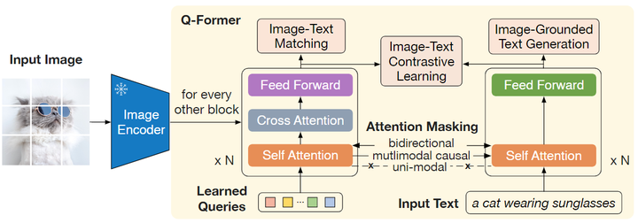
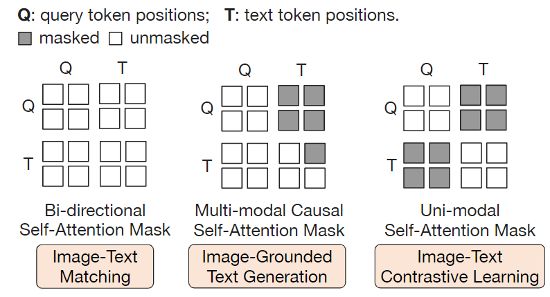
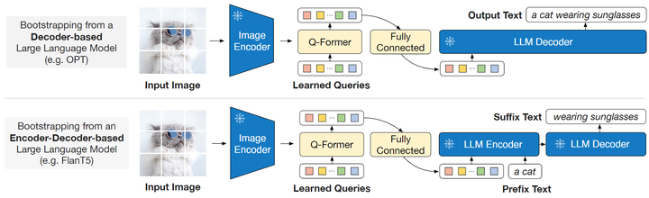
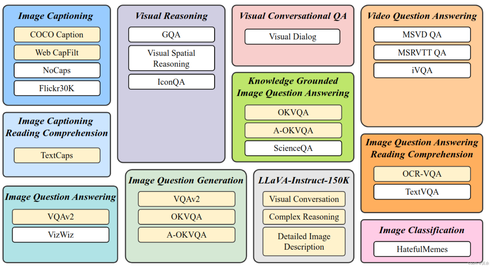
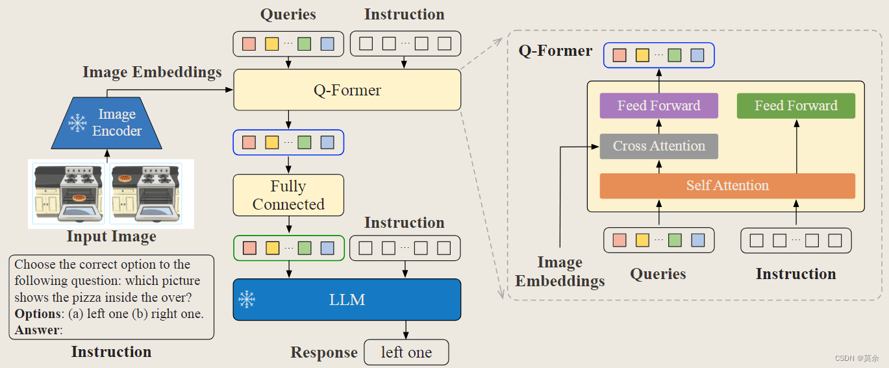

## BLIP2作用
多模态的研究属于是视觉和语言研究领域的交叉，因此大家很自然地期望视觉和语言模型可以从现成的视觉，语言的预训练模型中获得。为了节约视觉语言模型在预训练过程的计算代价，本文提出的 BLIP-2 希望**借助现成的预训练好的单模态视觉模型和单模态文本模型**。

这样做的好处是：**预训练的视觉模型能够提供高质量的视觉表征**。预训练的语言模型，尤其是大型语言模型 (LLM)，提供了强大的语言生成和零样本迁移能力。**为了减少计算成本并抵消灾难性遗忘的问题，单模态预训练模型在预训练期间保持冻结**。

但是，简单的冻结预训练好的视觉模型的参数或者语言模型的参数会带来一个问题：就是**视觉特征的空间和文本特征的空间不容易对齐**。

为了解决这个问题，BLIP-2 提出了一个轻量级的 Querying Transformer 充当视觉编码器和文本编码器之间的桥梁。

## BLIP模型结构
BLIP-2 由预训练好的，冻结参数的视觉模型和文本模型，外加所提出的可训练的 Q-Former 构成。
固定的图像编码器从输入图片中提取视觉特征，Q-Former 架构是由2个 Transformer 子模块构成，其中注意 Self-Attention 是共享的，可以理解为 **Self-Attention 的输入有2个，即：Queries 和 Text。**

第1个 Transformer 子模块： 是 Image Transformer，它**与图像编码器交互，用于视觉特征提取**。**它的输入是可学习的 Queries**，它们先通过 Self-Attention 建模互相之间的依赖关系，再**通过 Cross-Attention 建模 Queries 和图片特征的依赖关系**。Queries 也可以通过Self-Attention与文本输入做交互。

第2个 Transformer 子模块： 是 Text Transformer，它既可以作为文本编码器，也可以充当文本解码器。



Q-Former 一共包含了 188M 参数，其权重使用 BERT-Base 做初始化，Cross-Attention 的参数做随机初始化。
作者使用 **32 个 Queries，其中每个 Queries 的维度为 768**。Queries 随着预训练目标一起训练，迫使它们提取到与文本最相关的视觉信息。

## 损失函数
### 阶段1
训练的第一阶段与BLIP一样包含3个损失函数。

#### 1.图文对比学习(Image-Text Contrastive Learning, ITC)
旨在**对齐图像和文本的表征**，使其互信息最大化。
不允许 Queries 和 Text 相互看到 (相互之间的注意力值为0)

#### 2.基于图像的文本描述生成 (Image-Grounded Text Generation, ITG)
ITG 给定一张输入图片，旨在训练 Q-Former 生成对应的文本描述。
Queries 应该具备这样一种能力：**提取视觉表征并传递给解码器**。
因此，ITG 的 Attention Mask 方法如上图中间所示，属于 Multi-modal Causal Self-Attention Mask，**允许 Text 看到 Queries** (Queries 里面有视觉信息)，**同时每个 Text token 只能看到它之前的 Text token**(生成式任务的基本做法)。但是**不允许 Queries 看到 Text 的信息**，只能看到自己的信息。此外作者还将 [CLS] token 替换为一个新的 [DEC] token 作为第一个 Text token 来指示解码任务。

#### 3.图文匹配任务 (Image-Text Matching, ITM)
旨在更加细粒度地对齐图像和文本的表征，使其互信息最大化。ITM 是个二分类任务，要求模型预测图像-文本对是正样本 (匹配) 还是负样本 (不匹配)。ITM 的 Attention Mask 方法如上最左侧所示，属于 Bi-directional Self-Attention Mask，**允许 Queries 和 Text 相互看到**。
Queries 的输出 Z 捕获了多模态信息，把每个输出的 Queries Embedding 通过一个二类线性分类器中以获得 logit，并将 logit 的输出做平均作为最终的分数。

### 阶段2
在生成预训练的阶段，作者把 Q-Former 和冻结参数的 LLM 连接起来，以利用 LLM 的文本生成能力。
- 首先输入图片还是直接输入冻结参数的 Image Encoder，得到图像的表征；
- 然后图像的表征和 Queries 一起送入 Q-Former，得到 Queries 的输出 Z ，经过一个全连接层与 Text token 的维度对齐之后输入给 LLM Decoder。**这个 Queries 的输出就蕴含了视觉信**息，在输入给 LLM 的时候就充当了**Soft Visual Prompt**的作用。

```
## 将Q-former输出传到LLM方法
# 获取查询输出，这是模型处理查询后的结果
query_output = query_outputs[0]

# 将查询输出转化为适合语言模型的输入
language_model_inputs = self.language_projection(query_output)

# 创建一个全1注意力掩码，用于指示语言模型关注所有位置
language_model_attention_mask = torch.ones(
    language_model_inputs.size()[:-1], 
    dtype=torch.long, 
    device=language_model_inputs.device
)

# 获取输入嵌入，这是将输入ID映射到向量空间的过程
inputs_embeds = self.language_model.get_input_embeddings()(input_ids)

# 在维度1上连接语言模型输入和输入嵌入
inputs_embeds = torch.cat([language_model_inputs, inputs_embeds], dim=1)

# 检查是否存在注意力掩码，如果没有，则创建一个全1掩码
if attention_mask is None:
    attention_mask = torch.ones_like(input_ids)

# 确保注意力掩码与语言模型的注意力掩码在同一设备上
expected_device = language_model_attention_mask.device
# 合并两个注意力掩码，扩展模型的注意力范围
attention_mask = torch.cat([
    language_model_attention_mask, 
    attention_mask.to(expected_device)
], dim=1)
```
作者尝试了2种大型语言模型，分别是基于纯 Decoder 架构的和基于 Encoder-Decoder 架构的。
- 对于基于纯 Decoder 架构的模型，使用**语言建模目标函数**进行训练。冻结参数的 LLM 的任务是根据 Q-Former 提供的视觉表征来生成文本。
- 对于基于 Encoder-Decoder 架构的模型，**把文本分成两段，前缀随着 Queries 的输出喂给 LLM 的 Encoder，希望 Decoder 输出后缀。**


## InstructBLIP

### 数据
为了确保指令微调数据的多样性，作者收集了来自**11种不同任务的26个数据集**，并将它们转换为**指令调优格式**。


### 模型
instruction不仅会指导LLM生成文本，同时也会指导image encoder提取不同的视觉特征。这样的好处在于对于同一张图片，根据不同的instruction，我们可以得到基于instruction偏好更强的视觉特征，同时对于两个不一样的图片，基于instruction内嵌的通用知识，可以使得模型有更好的知识迁移效果。

**模型结构基本与BLIP2一致，Q-Former和LLM的输入多了Instruction。**

论文：https://arxiv.org/abs/2305.06500


