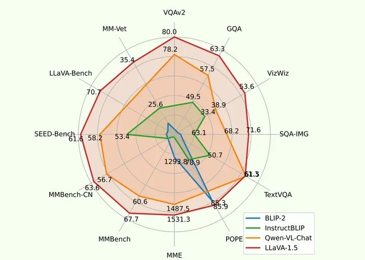
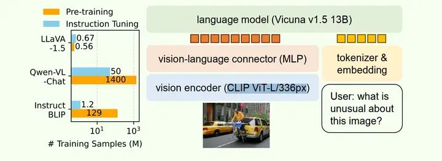
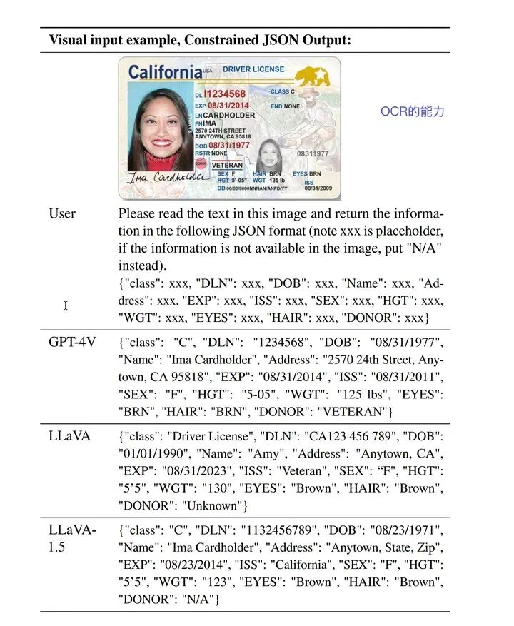

## LLaVA 1.5作用
通过对 LLaVA 进行简单修改，即使用带有 MLP 投影的 CLIP-ViT-L-336px 并添加学术任务导向的 VQA 数据和简单的响应格式提示，LLaVA 1.5在 11 项基准测试中达到了最先进水平。

## LLaVA 1.5模型结构

研究表明，LLaVA 的架构在视觉指令调整方面功能强大、数据效率高，与所有其他方法相比，它能以更少的计算量和训练数据实现最佳性能。
LLaVA 1.5和LLaVA在模型架构上基本一致，对LLM模型和插值层做了少量修改:
- LLM模型：LLM语言模型升级为**Vicuna v1.5 13B**，语言模型参数量更大，效果更好.
- Connector：也就是插值层，由原来的单个线性层替换为MLP层（多层线性层叠加）
- Vision Encoder: 输入图像分辨率由224增大为336，使用CLIP ViT-L/336px，对图像细节理解能力更强
- 更高质量的数据

### OCR
LLaVA模型具有in-context learning和零样本多语言功能的能力，比如OCR任务，不同于以往的深度学习OCR算法（必须单独训练针对OCR任务的模型），LLaVA本身就可以直接应用与OCR，指定合适的Prompt，就可以从图片中提取文字（或者说通用多模态-图生文大模型都具有这种能力）。

  
