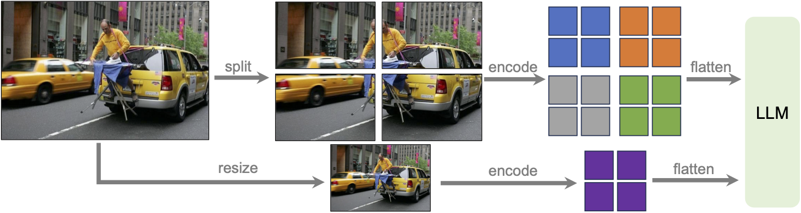
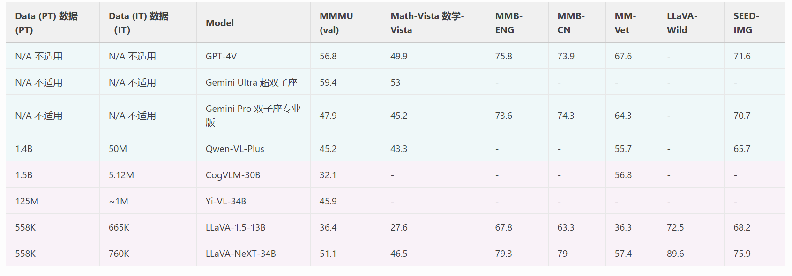
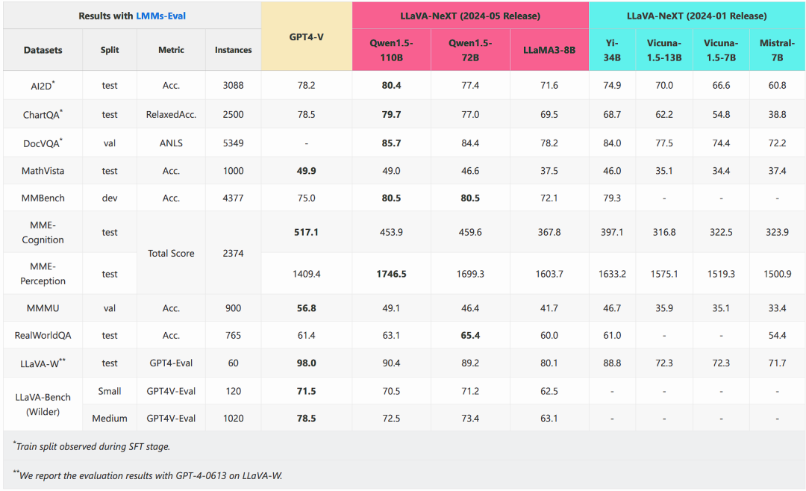
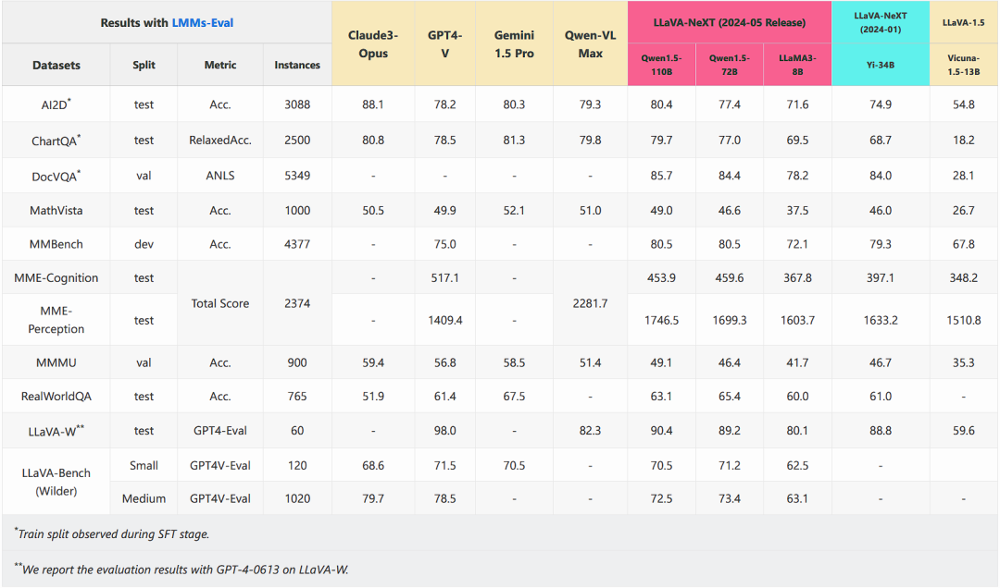

## LLaVA-NeXT作用
在LLaVA 1.5基础上进行了若干改进，在推理、OCR 和世界知识方面都得到了改进。在多项基准测试中，LLaVA-NeXT 甚至超过了 Gemini Pro。

## LLaVA-NeXT模型结构
### 动态高分辨率

支持更大的分辨率，包括672x672, 336x1344, 1344x336 几种分辨率的输入，并且支持通过图片裁切，编码，合并来实现。

### 数据混合

### 扩展 LLM 主干网
使用34B的Yi.

### 结果

- 模型效果在各项指标都直接有10个点以上的提升
- OCR能力提升：更好的推理和OCR能力：通过修改指令数据集实现
- 更好的视觉对话：在一些场景下，拥有更好的世界知识
### LLaVA-NeXT(2024-5-10)

#### 改进
- 使用更强大的LLaMA3 (8B) 和 Qwen-1.5 (72B 和 110B)
- 收集并开发了新的评估数据集 LLaVA-Bench (Wilder)，它继承了 LLaVA-Bench (in-the-wild) 的精神，用于研究日常生活中的可视化聊天，并扩大了数据量以进行综合评估

在某些基准上赶上了GPT-4V
