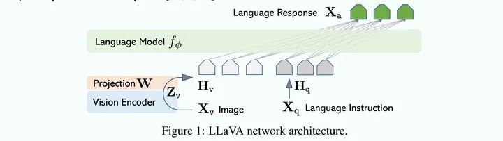
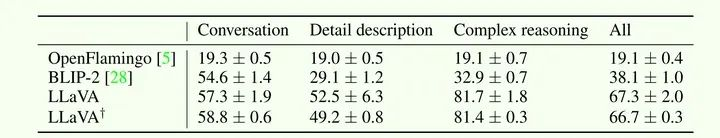

## LLaVA作用
LLaVA(Large Language and Vision Assistant)

## LLaVA模型结构

- 视觉编码器:**CLIP 视觉编码器 ViT-L/14**,输出是最后一个变换器层之前和之后的网格特征。
- 语言模型:Vicuna 
- 投影层:简单的线性层将图像特征连接到词嵌入空间

### 模型训练
- 阶段一：**特征对齐**预训练。由于从CLIP提取的特征与word embedding不在同一个语义表达空间，因此，需要通过预训练，将image token embedding对齐到text word embedding的语义表达空间。这个阶段冻结Vision Encoder和LLM模型的权重参数，只训练插值层Projection W的权重。
- 阶段二：端到端训练。这个阶段，依然冻结Vision Encoder的权重，训练过程中同时更新插值层Projection W和LLM语言模型的权重，训练考虑Multimodal Chatbot和Science QA两种典型的任务。

### 实验结果

实验结果表明LLaVA在对话、细节描述和复杂推理等任务上均优于BLIP-2。
