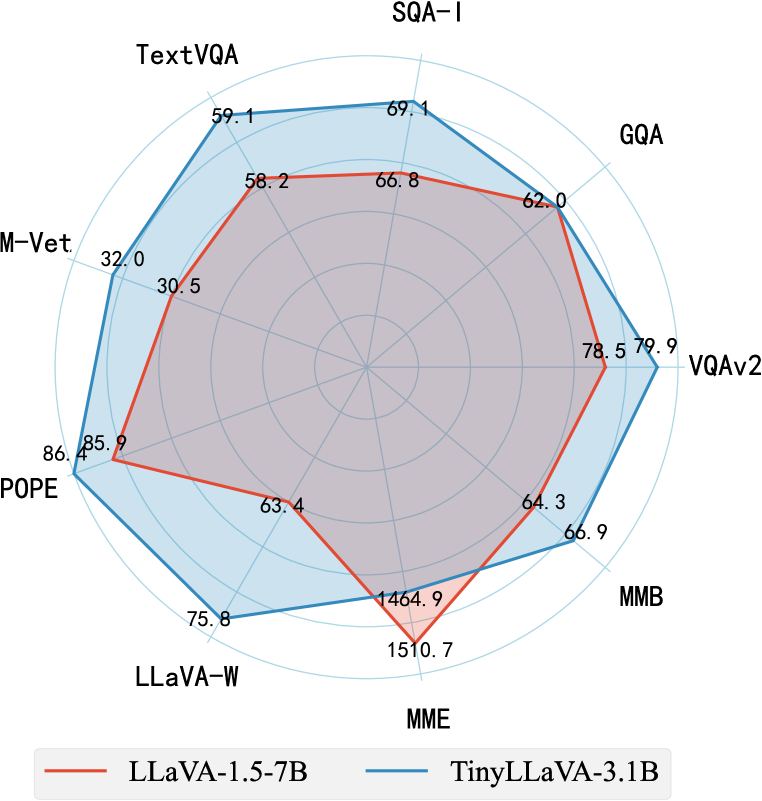
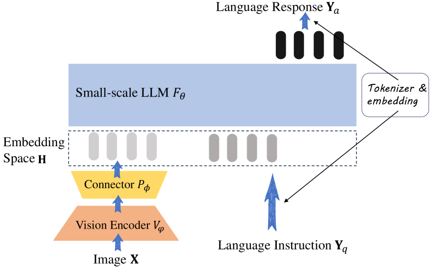
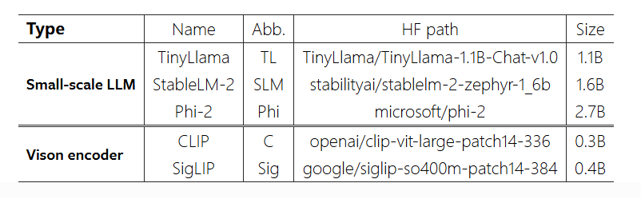
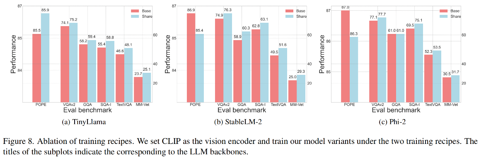
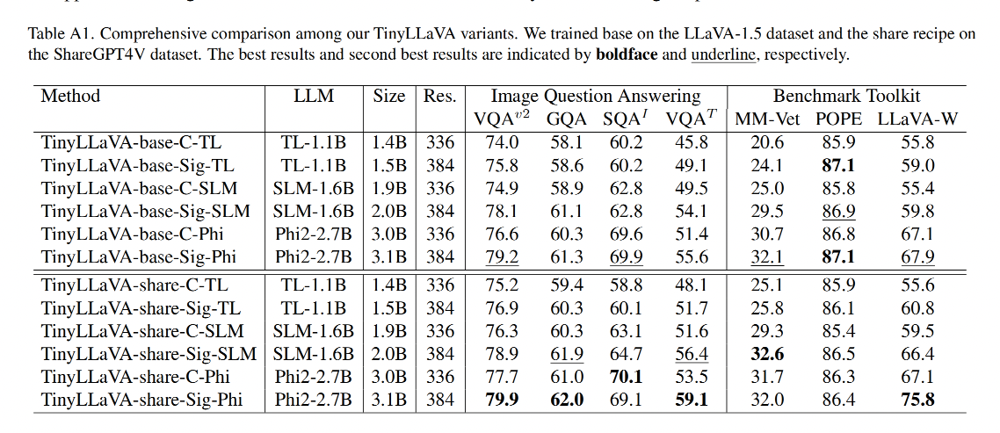
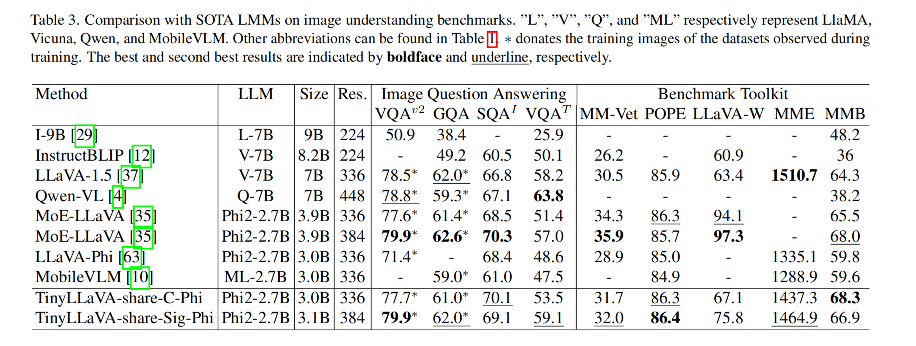

## TinyLLaVA作用
- 实现一个利用**小型 LLM**实现大型 LMM 的模型框架，框架由视觉编码器、小型 LLM 解码器和中间连接器组成。
- 作者探究了不同的 vision encoder、connector、language model、training data、train recipes 组合起来的效果
- 证明了通过更好的训练组合方式和更高质量的数据，使用较小的 LMM 就能实现较大模型相当的性能
**最好的 TinyLLaVA-3.1B 能够取得和 LLaVA-1.5、QWen-VL 等 7b 大小的模型相当的效果**。

## TinyLLaVA模型结构

沿用了 LLaVA 的设计，但在此基础上进行了概括，以便以统一的视角更好地研究模型架构和训练配方的变体。

Connector：GELU 激活函数的MLP

### 训练
- 1.特征对齐的预训练
- 2.监督微调

#### 训练方案
##### base(来源于LLaVA-v1.5)
在 pretrain 阶段中，只更新 connector 的参数， LLM 和 vision encoder 都冻结，训练 1 epoch，学习率为 1e-3，batch size 为 256
在 SFT 阶段中，**冻结 vision encoder，更新其他两个模块**，训练 1 epoch，学习率为 2e-5，batch size 为 128

##### share(来源于ShareGPT4V)
在 pretrain 阶段中，作者使用 base 的 pretrain 阶段训练的 connector 来初始化这里的 connector，**冻结 vision encoder 的前 12 层，更新其他所有模块的参数**，学习率为 2e-5，batch size 为 256
在 SFT 阶段中，和 base 的一样，冻结 vision encoder，更新其他两个模块，训练 1 epoch，学习率为 2e-5，batch size 为 128
效果对比：

当模型在更大规模和更多样化的ShareGPT4V数据集上进行预训练时，使用 share 可以显著提升所有变体的性能。也就是当使用小规模LLM时，微调视觉编码器可以提升性能。
使用 share 策略时，StableLM-2 和 Phi-2 在其他 benchmark 上有性能提升，但在 pope 上性能下降了很多（说明**有更多的幻觉**）

### 结果

