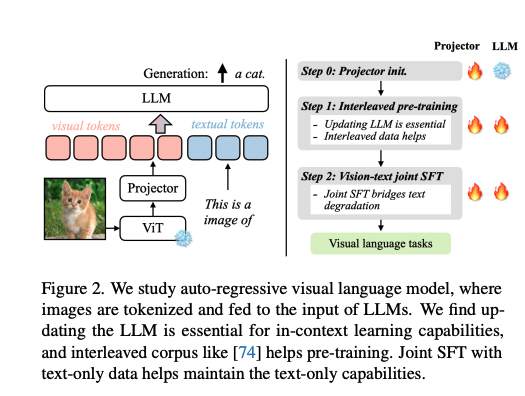
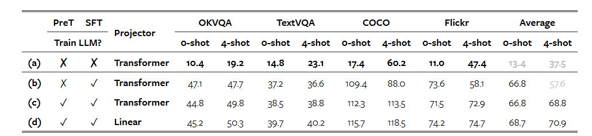
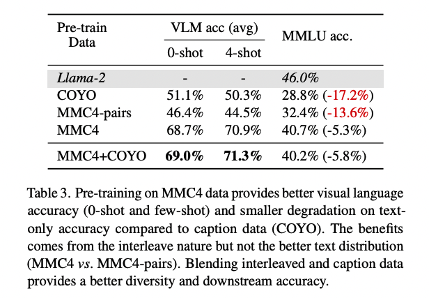

## VILA作用
作者遵循了预训练 + SFT 的流程，并对监督数据集属性和训练协议进行了不同设计选项的消融实验。发现了几个有趣的结果：
（1）**在预训练期间冻结LLM可以实现不错的零样本性能，但无法实现上下文学习（ICL）能力**，而更新LLMs则鼓励**深度嵌入对齐**，作者发现这对于ICL非常重要；
（2）交错的视觉语言数据对于预训练至关重要，它提供了准确的梯度更新并**保持了纯文本能力**；
（3）在SFT期间添加纯文本指令数据可以进一步补救纯文本退化并提升视觉语言任务的准确性。

## VILA模型结构

与LLaVA模型结构一致。
投影器可以是简单的线性层或功能更强的 Transformer 块，作者在实验中比较它们的功效。

关于在视觉语言预训练（PreT）期间是训练 LLM 还是冻结 LLM 并只进行及时调整的消融研究：
- 在预训练期间冻结 LLM 并不会影响 0-shot的准确性，但会**导致更差的上下文学习能力**（更差的 4-shot）。
- **使用简单的线性投影器会迫使 LLM 学习更多内容，从而获得更好的泛化效果**。

### 训练数据
使用COYO进行预训练会导致“**灾难性遗忘**”，即模型忘记了如何处理纯文本任务。纯文本任务的准确性下降了17.2%（MMLU）。视觉语言任务的准确性也显著下降，特别是在4-shot设置下表现更差，这表明模型无法正确进行上下文学习，因为它在预训练期间从未见过超过一张图像。

**交错数据集(MMC4) 的优势**：
MMC4的数据分布与纯文本语料库更接近。使用交错数据进行预训练时，纯文本任务的准确性只下降了约5%。通过适当的指令微调，这种降级可以完全恢复。交错数据促进了视觉上下文学习，使得4-shot设置下的准确性高于0-shot设置。

