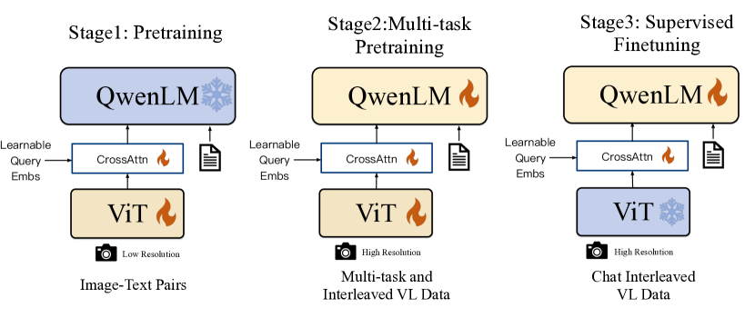
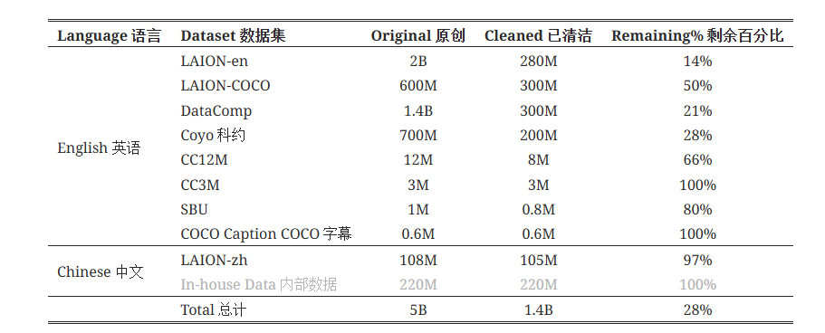
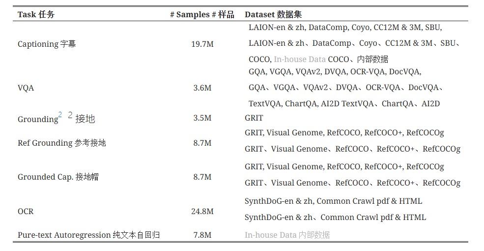

## Qwen-VL作用
- Qwen-VL 在大量以视觉为中心的理解基准上实现了优秀的性能
- Qwen-VL 支持多语言，尤其是英文和中文，自然的支持英文、中文和多语言指令
- Qwen-VL 在训练阶段**支持任意交错的图像-文本数据**作为输入
- Qwen-VL 在细粒度的图像理解上更好，因为在训练中使用了更高分辨率的输入大小*细粒度的语料库，**有很好的文本阅读、面向文本的问答、细粒度的对话等能力**

## Qwen-VL模型结构

- 视觉编码器：使用 Openclip 的 ViT-bigG 
- Qwen-VL 采用大型语言模型Qwen-7B 作为其基础组件。
- **位置感知视觉语言适配器**：为了缓解长图像特征序列带来的效率问题，Qwen-VL 引入了视觉语言适配器来**压缩图像特征**。该适配器包括一个随机初始化的**单层交叉注意模块**。该模块使用一组**可训练向量（嵌入）作为查询向量**，并将来自视觉编码器的图像特征作为交叉注意操作的密钥。这种机制将视觉特征序列压缩到 256 的固定长度。

### 训练
#### Pre-training

在此阶段，训练过程中会**冻结大型语言模型，仅优化视觉编码器和 VL 适配器**。输入图像的大小调整为224*224。训练目标是最小化文本标记的交叉熵。最大学习率为2e-4，训练过程中图像-文本对的批量大小为 30720，整个第一阶段的预训练持续了 50,000 步，消耗了大约 15 亿个图像-文本样本。

#### Multi-task Pre-training

将视觉编码器的输入分辨率从 224×224提高到 448×448，从而减少了图像降采样造成的信息损失。
训练过程中解冻了大型语言模型，并对整个模型进行了训练。训练目标与预训练阶段相同。

#### Supervised Fine-tuning
在这一阶段，我们通过指令微调对 Qwen-VL 预训练模型进行微调，以增强其指令跟随和对话能力，最终形成交互式 Qwen-VL-Chat 模型。多模态指令微调数据主要来自LLM自我指令生成的标题数据或对话数据，这些数据通常只涉及单幅图像的对话和推理，仅限于图像内容理解。

通过手动注释、模型生成和策略串联构建了一组额外的对话数据，从而将定位和多图像理解能力纳入 Qwen-VL 模型。我们证实，该模型能有效地将这些能力转移到更广泛的语言和问题类型中。此外，我们还在训练过程中混合了多模态和纯文本对话数据，以确保模型在对话能力方面的通用性。**指令调整数据达 350k**。在这一阶段，我们将**冻结视觉编码器，并优化语言模型和适配器模块**。