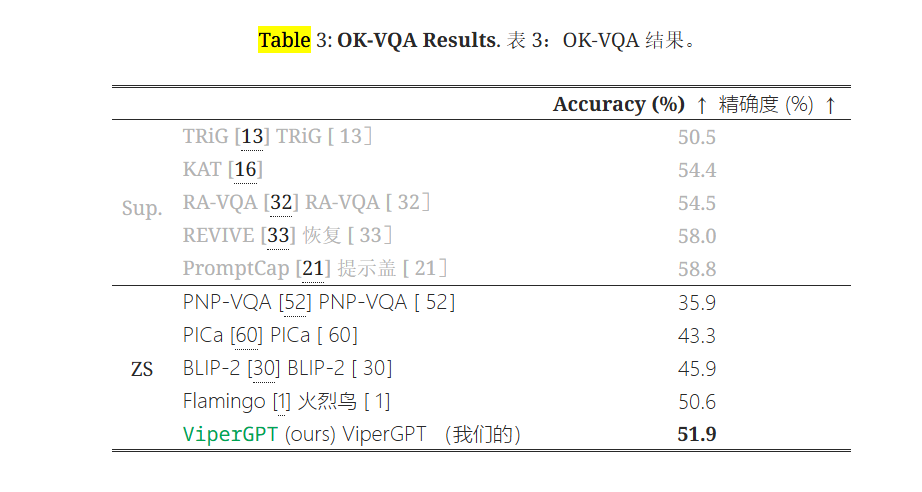

## ViperGPT作用
回答视觉查询是一项复杂的任务，既需要视觉处理，也需要推理。端到端模型是完成这项任务的主流方法，但它并不能明确区分视觉处理和推理，从而限制了可解释性和通用性。**学习模块化程序是一种很有前景的替代方法**，但由于同时学习程序和模块的难度很大，因此被证明具有挑战性。
ViperGPT 是一个利用代码生成模型的框架，可将视觉和语言模型组成子程序，为任何查询生成结果。**ViperGPT 利用提供的应用程序接口访问可用模块，并通过生成 Python 代码将其组合起来，随后执行**。这种简单的方法**无需进一步培训，就能在各种复杂的视觉任务中取得最先进的结果**。

## ViperGPT模型结构

给定视觉输入和查询后，ViperGPT会合成一个execute_command程序，该程序的输入是图片或视频，然后用 Python 解释器执行，以生成最终答案。

ViperGPT使用代码生成大模型来生成execute_command程序，可根据定义任务的任何文本查询灵活地组成视觉模型。**它为每个查询创建定制程序**，将图像或视频作为参数，并返回该图像或视频的查询结果。

研究表明，**向Codex提供开放各种视觉功能（如查找、计算深度）的应用程序接口（API），就像向工程师提供应用程序接口一样，足以创建这些程序**。模型之前接受的代码培训使其能够推理出如何使用这些功能并实现相关逻辑。
研究结果表明，这种简单的方法可以提供出色的 "zero-shot"性能（即无需对特定任务的图像进行训练）。

### prompt
ViperGPT的提示词包括一个应用程序编程接口(API)，具体API根据需要完成的任务略有不同，将该接口作为 LLM 输入上下文的一部分提供给 LLM 。L
**LM 的最终输入是一串代码文本，其中包括 API 规范，然后是正在考虑的示例的查询**。预期输出是一个 Python 函数定义字符串，然后对其进行编译和执行。

API输入示例：

## ViperGPT模型评估
### 1.视觉定位(查找物体的边界框)
输入API如下：
- **find(GLIP):** 输入图像和一个简短的名词短语（如 "汽车 "或 "金毛猎犬"），并返回包含该名词短语的图像片段列表。 
- **exists(GLIP):** 输入图像和一个简短的名词短语，并返回一个布尔值，表示图像中是否存在该名词短语的实例。
- **verify_property(X-VLM):** 的输入是一幅图像、一个代表一个对象的名词短语和一个代表该对象属性的属性；它返回一个布尔值，表明该属性是否存在于图像中。 
- **best_image_match(X-VLM):** 的输入是图像补丁列表和一个名词短语，它返回与该名词短语最匹配的图像补丁。，
- **best_text_match:** 将一个名词短语列表和一幅图像作为输入，并返回与图像最匹配的名词短语。它们是使用 CLIP中的图像-文本相似性模型实现的。
- **compute_depth(MiDaS):** 计算图像补丁的深度中值。
- distance 函数，该函数仅使用内置的 Python 工具计算两个图块之间的像素距离。

### 2.合成图像问题解答
对 ViperGPT 的图像问题解答进行了评估。重点评估对组合问题的解答上，这需要将复杂的问题分解成更简单的任务。

### 3.依赖外部知识的图像问题解答
许多有关图像的问题只能通过整合外部世界知识才能得到正确解答。通过为 ViperGPT 配备用自然语言查询外部知识库的模块，它可以将知识与视觉推理相结合来处理这类问题。我们添加了一个新模块**llm_query（GPT-3）**，它**利用文本模型作为非结构化知识库**。

### 4.视频因果/时间推理

## 代码分析
- **vision_models.py**：此文件包含预训练模型的代码，所有模型都是BaseModel的子类。这种设计使得添加新模型变得非常简单，只需创建一个新的从BaseModel继承的类，然后实现forward方法和name方法即可。
- **image_patch.py 和 video_segment.py**：实现相关功能所需要的API方法。
- **main_batch.py 和 main_simple.ipynb**：这是运行代码的主要文件。前者运行整个数据集，适合样本的并行处理，而后者运行单个图像/视频，适合调试。

