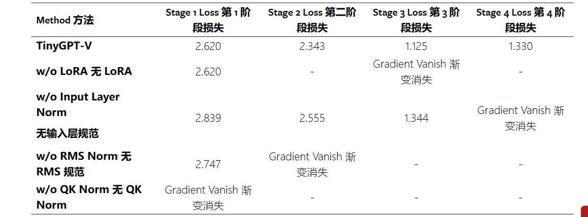

## TinyGPT-V作用
 TinyGPT-V是一种**专为高效训练和推理而设计的新型模型**，训练时只需 24GB GPU 内存，**推理时只需 8GB GPU 或 CPU 内存**。该模型利用先进的大型语言模型Phi-2，miniGPT4的预训练视觉模块作为视觉编码器，再加上一个映射模块，以促进视觉信息的整合。
 在训练过程中，TinyGPT-V 采用了一种新颖的训练方法，不同于其他任何 MLLM，它侧重于预先训练的小型骨干，利用视觉编码器和语言模型之间独特的映射模块以及新颖性归一化方法，

## TinyGPT-V模型结构

为了加快模型训练速度，TinyGPT-V采用 BLIP-2 架构中的 Q-Former 层作为初始投影层，旨在充分发挥视觉语言模型中预训练 BLIP 系统的潜力。这一策略**大大减少了需要训练的参数数量(压缩了视觉tokens的数量)**。
为了加快 TinyGPT-V 的训练，使用 MiniGPT-4 中预先训练好的线性投影层（Vicuna 7B）作为第二层。然后，我们引入一个额外的线性投影层，以高斯分布进行初始化，作为第三层，使得模型适应 Phi-2 模型的输入维度。

训练较小规模的大型语言模型进行迁移学习，尤其是跨不同模态（如从文本到图像）的迁移学习，会带来巨大的挑战。研究表明，**这些较小的模型在多模态数据计算过程中很容易遇到 NaN 或 INF 值**。这个问题往往会导致计算损失值为 NaN，从而导致初始批量前向传播失败。此外，这些模型中可训练参数的数量有限，可能会导致训练过程中梯度消失。
为了缓解这些问题，TinyGPT-V采用了 LLaMA-2 中的后规范和输入规范机制，在每个多头注意力层（MHA）之后应用 RMS 规范来规范数据，以便进行下游处理。此外，我们还必须更新 Phi-2 模型中的所有层规范，以提高训练的稳定性。

### TinyGPT-V训练方法

- 第一个训练阶段的热身训练。
- 第二训练阶段的预训练。在初始训练阶段之后，大语言模型开始具备处理图像模态输入的能力。为了保证模型在过渡到后续训练阶段时性能更加稳定，我们重新使用了第一阶段的数据集，专门用于训练 **LoRA 模块**。
- 第三训练阶段的指令调整,使用 MiniGPT4 或 LLaVA 中精选的图像-文本配对来微调 TinyGPT-V 模型。
- 第四训练阶段的多任务学习。TinyGPT-V 的第四个训练阶段主要是通过使用更多的多模式指令数据集（包括 LLaVA、Flickr30k、混合多任务数据集和使用多任务模板的非自然指令）来调整模型
- 
