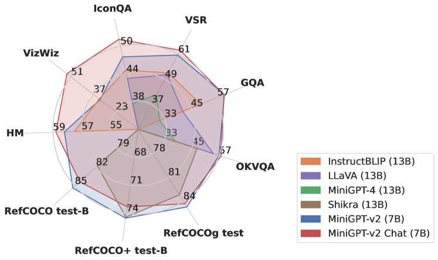
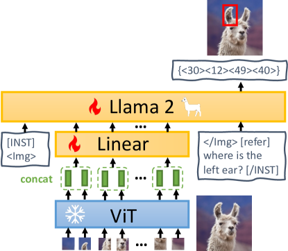
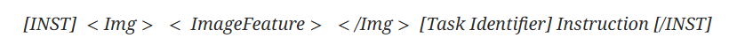
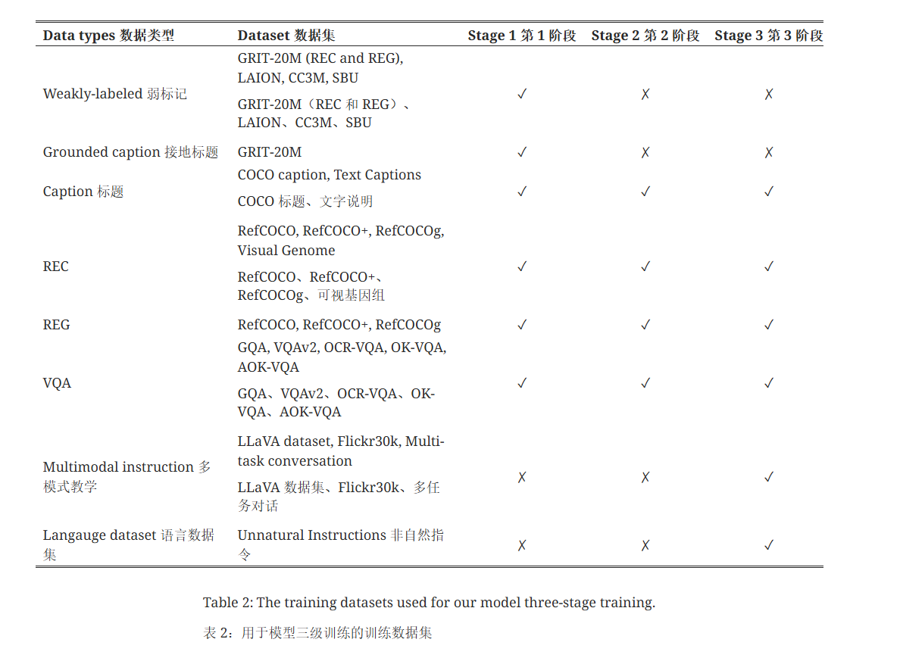

## miniGPT-v2
与其他通用模型相比,MiniGPT-v2 在各种视觉语言任务中都取得了最先进的性能

## miniGPT-v2模型架构

MiniGPT-v2由三个部分组成：视觉骨干层、线性投影层和大型语言模型。
- 采用EVA作为视觉骨干模型骨干。在整个模型训练过程中冻结视觉骨干。该模型以 448x448 的图像分辨率来训练模型，并根据更高的图像分辨率对位置编码进行插值。
- 线性投影层。我们的目标是将冻结视觉骨干中的所有视觉标记投射到语言模型空间中。然而，对于 448x448 等更高分辨率的图像，投射所有图像标记会导致非常长的序列输入（例如 1024 个标记），从而大大降低训练和推理效率。因此，我们只需**将嵌入空间中相邻的 4 个视觉标记串联起来，投射到大语言模型同一特征空间中的单个嵌入中**，从而将视觉输入标记的数量减少 4 倍。
- 采用开源的 LLaMA2-chat (7B)作为语言模型骨干。在该工作中，语言模型被视为各种视觉语言输入的统一接口。模型直接依靠 LLaMA-2 语言标记来执行各种视觉语言任务。对于需要生成空间位置的视觉定位任务，要求语言模型生成边界框的文本表示，以表示其空间位置。

当针对多个不同任务（如视觉问题解答、图像标题、指代表达、接地图像标题和区域识别）训练一个统一模型时，多模态模型可能无法通过将视觉标记与语言模型对齐来区分每个任务。
为了使每项任务都易于区分，在设计的多任务指令模板中**引入了任务特定标记**。

在这个模板中，[INST] 被视为用户角色，[/INST] 被视为助手角色。我们将用户输入分为三个部分。第一部分是图像特征，第二部分是任务标识符，第三部分是指令输入。

### 三阶段训练

- 第一阶段是通过许多弱标签图像文本数据集和高质量细粒度视觉语言注释数据集（我们将为弱标签图像文本数据集分配较高的数据采样率），帮助 MiniGPT-v2 **建立广泛的视觉语言知识**。
- 第二阶段是利用多个任务的细粒度数据改进模型。
- 第三阶段是使用**更多的多模态指令和语言数据集对我们的模型进行微调，以便更好地回答各种多模态指令**，并表现出多模态聊天机器人的特征。