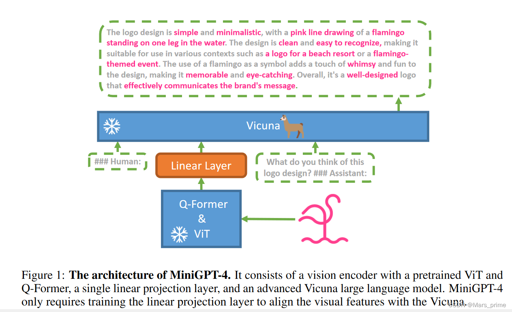
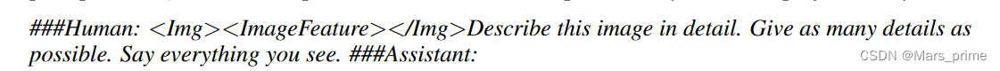
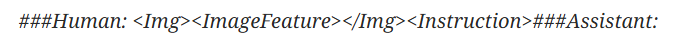
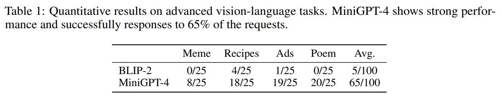
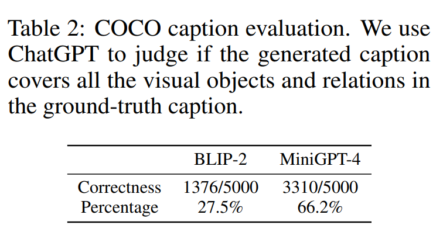
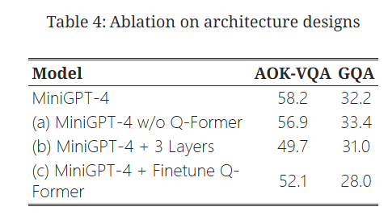

## miniGPT4作用
GPT-4表现出了非凡的多模态能力，比如直接从手写文本生成网站和识别图像中的幽默元素，这些能力在先前的工作中很少见，但是GPT-4背后的技术细节仍未公开。
miniGPT4作者认为**GPT-4增强的多模态生成能力源于利用复杂的大型语言模型（LLM）**。为了研究这一现象，提出了MiniGPT-4，**通过一个映射层（Projection ）将一个冻结的视觉编码器与一个冻结的先进LLM Vicuna进行对齐**。

## miniGPT4模型结构

MiniGPT-4 旨在**将来自预训练视觉编码器的视觉信息与高级大语言模型 (LLM) 对齐**。
- 使用**Vicuna**作为我们的语言解码器，它是在 LLaMA 的基础上构建的，可以执行各种复杂的语言任务。
- 对于视觉感知，我们采用与**BLIP-2中使用的相同视觉编码器**、ViT 主干网络以及他们预先训练的 Q-Former。语言和视觉模型都是开源的。
- 并使用线性投影层来弥合视觉编码器和 LLM 之间的差距。

### 两阶段训练方法
- 初始阶段涉及**在大量对齐的图像文本对上对模型进行预训练，以获取视觉语言知识**。
- 在第二阶段，使用**较小但高质量的图像文本数据集**和**设计的对话模板对预训练模型进行微调**，以增强生成的可靠性和可用性。

#### 第一预训练阶段
在最初的预训练阶段，该模型旨在从大量对齐的图像-文本对中获取视觉-语言知识。**模型将注入投影层的输出视为 LLM 的软提示，提示其生成相应的真实文本**。在整个预训练过程中，预训练的视觉编码器和LLM都保持冻结状态，只有线性投影层被预训练。

第一个预训练阶段的问题在第一个预训练阶段之后，MiniGPT-4 展示了拥有丰富知识并对人类查询提供合理响应的能力。存在**产生不连贯的语言输出**等问题，例如重复的单词或句子、支离破碎的句子或不相关的内容。这些问题阻碍了 MiniGPT-4 与人类进行流畅的视觉对话的能力。

GPT-3也存在与此类似的挑战。尽管 GPT-3 在广泛的语言数据集上进行了预训练，但仍难以生成与用户意图准确一致的语言输出。通过根据人类反馈进行指令微调和强化学习的过程，GPT-3 演变成 GPT-3.5，并且能够产生更加人性化的输出。
这种现象与 MiniGPT-4 在初始预训练阶段后的当前状态相似。因此，在第二阶段训练中采用与此类似的方法进行指令微调。

#### 第二阶段微调
##### 指令微调数据集
采用从第一个预训练阶段导出的模型来生成输入图像的全面描述。为了使我们的模型能够生成更详细的图像描述，作者设计了一个**遵循 Vicuna语言模型的对话格式的提示**，如下所示。在此提示中，\<ImageFeature\>表示线性投影图层产生的视觉特征。

从 Conceptual Caption 数据集中随机选择 5,000 张图像，并使用预训练模型为每个图像生成相应的语言描述。经过一系列的过滤步骤，最终得到 3500 个高质量的图像描述对。

##### 微调
在微调过程中，作者使用以下模板中的预定义提示：

在此提示中，\<Instruction\>表示从预定义指令集包含不同形式的指令，例如“详细描述此图像”或“你能为我描述此图像的内容吗”。在计算损失时，会屏蔽提示词部分。

## 实验
作者通过各种定性示例展示MiniGPT-4模型的多样化和涌现能力。这些能力包括生成详细的图像描述、识别图片中有趣的方面、根据照片提供食谱、为图片写诗等。此外，还提供了图像字幕任务的定量结果。

### 模型结构消融实验
实验采用了不同的架构设计进行了如下措施，以进一步展示使用单个线性层来对齐视觉特征与LLM的有效性：

(a) 移除了QFormer，并直接将VIT的输出映射到Vicuna的嵌入空间（即没有Q-former）。
(b) 使用了三个线性层而不是一个层。
(c) 另外对视觉模块中的Q-Former进行微调。

#### 实验结果：
- 变体 (a) MiniGPT-4 w/o Q-Former 的性能与原始设计相似。这表明，**BLIP-2 中的 Q-Former 对高级技能并没有起到关键作用**。
- 此外，(b) MiniGPT-4+ 3 层和(c) MiniGPT-4 + 微调 Q-Former 这两个变体的表现都略逊于原始的 MiniGPT-4。这表明，**在有限的训练数据设置中，单个投影层足以使视觉编码器和大型语言模型保持一致**。
