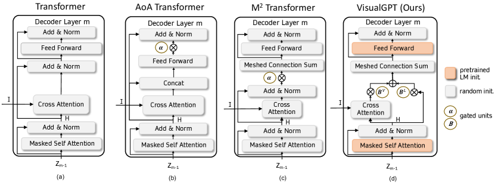
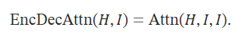
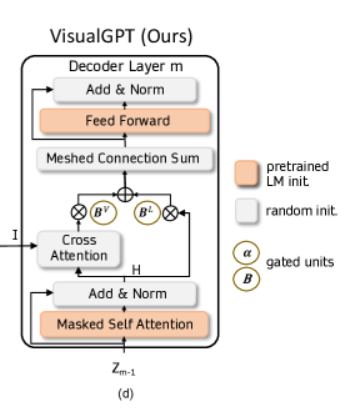
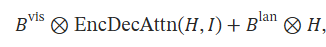
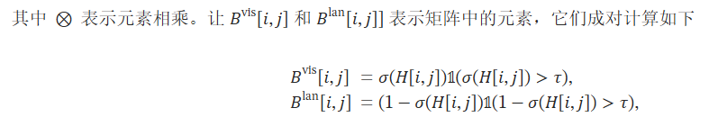
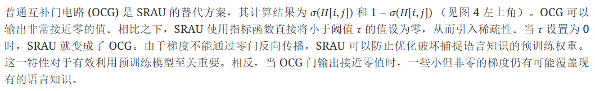

## VisualGPT作用
注释数据的有限可用性往往会阻碍机器学习在现实世界中的应用。为了高效地从少量多模态数据中学习，VisualGPT利用了来自大型预训练语言模型（PLM）的语言知识，并将其快速调整到新的图像字幕领域。要有效利用预训练模型，**平衡视觉输入和来自预训练的先验语言知识**至关重要。

VisualGPT 采用了一种新颖的自校正编码器-解码器注意机制，可利用**少量域内图像-文本数据快速调整 PLM**。所提出的自校正激活单元可产生稀疏激活，**防止语言知识被意外覆盖**。

## VisualGPT模型结构

编码器-解码器注意力将视觉编码𝐼和解码器的当前状态𝐻作为输入。交叉注意力层以𝐻作为查询，以𝐼作为键和值来应用注意力操作。编码器-解码器的关注度为：


在设计编码器-解码器注意力时，我们的目标是仔细**平衡编码器提供的视觉信息和 PLM 中存储的语言知识**。
- 在生成 "人"、"卡车 "或 "狗 "等视觉词时，模型应关注视觉信息。相比之下，
- 生成限定词或连接词只需要语言知识。

理想情况下，我们希望利用 PLM 权重中存储的大量语言知识，同时只在需要时才参考视觉输入。为了实现这一目标，我们引入了一对专门的**门控单元**。

### Self-Resurrecting Activation Unit(自校正激活单元)

**EncDecAttn(𝐻,𝐼)可以看作是用视觉信息𝐼对语言信息𝐻进行编码**。在 VisualGPT 中，使用了两个互补门$B^{vis}$和$B^{lan}$来控制这两种模式之间的平衡。该模块的输出为:






SRAU 的另一个优势是它**能够摆脱零输出**。一个门的输出可能为零，梯度为零，而另一个门的梯度仍然可用这种不对称性使得基于梯度的优化可以通过改变其他门来改变零输出门。该门控单元被命名为**自校正激活单元**。

实现：
```
## encoder_output：视觉编码器输出
def forward(self, x, layer_past=None,mask_queries=None,encoder_output=None,mask_encoder=None, mask_self_attention=None, tau = 0):
    threshold = tau ##阈值 

    self_attention, present = self.attn(self.ln_1(x), layer_past=layer_past,mask_self_attention=mask_self_attention)
    a = x + self_attention
    a = self.resid_pdrop(a)

    ## 分别使用三层视觉编码器的输出作为key和value
    ## 使用的ViT只有3层
    ## 视觉分支交叉注意力的输出
    enc_att1 = self.enc_dec_attn(x=self.ln_1(a), encoder_output=self.ln_1(encoder_output[:, 0]),mask_encoder=mask_encoder)
    
    enc_att2 = self.enc_dec_attn(x=self.ln_1(a), encoder_output=self.ln_1(encoder_output[:, 1]),mask_encoder=mask_encoder)
    
    enc_att3 = self.enc_dec_attn(x=self.ln_1(a), encoder_output=self.ln_1(encoder_output[:, 2]),mask_encoder=mask_encoder)
    
    ## 门控值
    alpha1 = torch.sigmoid(self.fc_alpha1(torch.cat([a, enc_att1], -1)))
    alpha2 = torch.sigmoid(self.fc_alpha2(torch.cat([a, enc_att2], -1)))
    alpha3 = torch.sigmoid(self.fc_alpha3(torch.cat([a, enc_att3], -1)))


    linguistics_alpha1_mask = torch.where(alpha1 > threshold, torch.ones_like(alpha1), torch.zeros_like(alpha1))
    linguistics_alpha2_mask = torch.where(alpha2 > threshold, torch.ones_like(alpha2), torch.zeros_like(alpha2))
    linguistics_alpha3_mask = torch.where(alpha3 > threshold, torch.ones_like(alpha3), torch.zeros_like(alpha3))


    visual_alpha1_mask = torch.where(alpha1 < 1-threshold, torch.ones_like(alpha1), torch.zeros_like(alpha1))
    visual_alpha2_mask = torch.where(alpha2 < 1-threshold, torch.ones_like(alpha2), torch.zeros_like(alpha2))
    visual_alpha3_mask = torch.where(alpha3 < 1-threshold, torch.ones_like(alpha3), torch.zeros_like(alpha3))


    ## 合并视觉分支和语言分支
    enc_att1 = alpha1* linguistics_alpha1_mask * a + (1-alpha1)* visual_alpha1_mask * enc_att1
    enc_att2 = alpha2* linguistics_alpha2_mask * a + (1-alpha2)* visual_alpha2_mask * enc_att2
    enc_att3 = alpha3* linguistics_alpha3_mask * a + (1-alpha3)* visual_alpha3_mask* enc_att3

    enc_att = (enc_att1 + enc_att2 + enc_att3) / np.sqrt(3)
    a = enc_att * mask_queries

    m = self.mlp(self.ln_2(a))

    encoder_result = a + m

    encoder_result = self.resid_pdrop(encoder_result)

    encoder_result = encoder_result  * mask_queries
    return encoder_result, present
```

