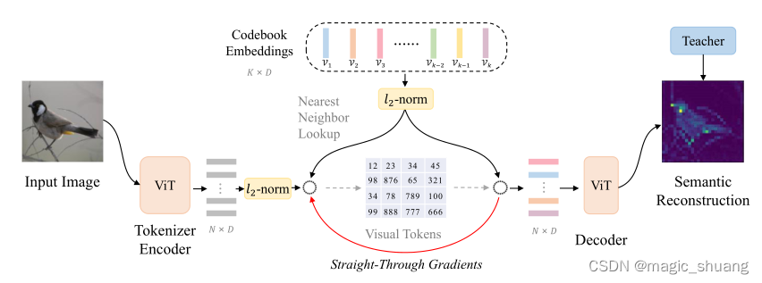

## BEiT-2 作用
提出了 Vector-Quantized 知识提取，将MIM**从像素级提升到语义级**，用于自监督表示学习。

**引入了一种 patch 聚合策略，该策略在给定离散语义 token 的情况下强制执行全局结构**，并提高了学习表示的性能。

对下游任务进行了广泛的实验，包括ImageNet微调、线性预测和语义分割。实验结果表明，所提出的方法显著提高了模型大小、训练步骤和下游任务的性能。

## BEiT-2 模型架构

### Visual Tokenizer
使用**Vector-Quantized 知识蒸馏(VQ-KD)** 来训练visual tokenizer.

1. **Tokenizer Encoder首先将输入图像编码为向量**。灰色条：$z = [z_1，z_2，··，z_N]$
2. 在codebook 中查找每个 patch 表示$h_i$的最近邻居$v_j$。设$\{v_1，v_2，··，v_K\}$ 表示 codebook embeddings，对于第i个图像patch，其量化代码计算为:

其中$l2(x)$指对x进行L2归一化。
3. 在将图像量化为 visual token 之后，我们将L2-normalized codebook embeddings 送到Decoder,得到输出$o_i$.
4. 输出向量$o_i$旨在**重建teacher模型(如CLIP，DINO)的语义特征**。设$t_i$表示第i个图像patch 的 teacher 模型的特征向量。在训练过程中，我们**最大化解码器输出$o_i$和teacher指导$t_i$之间的余弦相似性**。

VQ-KD的训练目标为:最大化余弦相似度，最小化重建向量和码本的距离，式子如下：

其中$sg[·]$代表停止梯度算子。

vector quantization 训练的一个常见问题是**codebook 崩溃**(只使用一部分码本)。
缓解这个问题:**指数移动平均用于更新codebook embedding**。

### EMA

### 预训练BEiT V2

1. $ℒ_{MIM}$损失与BEiT-1相同。
2. **为了减少patch级预训练与图像级表示聚合之间的差异**,增加了对 [CLS] 标记进行了全局图像表征预训练，方法如下:
- 将最后一层[CLS]标记输出$h_{CLS}^L$和第$l$层的输出向量$h_i^l$连接，得到$S=[h_{CLS}^L，h_1^l，··，h_N^l]$,将𝑺送入浅层（例如两层）变换器解码器，并再次进行掩码预测(**两个 MIM 头的参数是共享的**),计算损失$ℒ_{MIM}^c$,最终的训练损耗被定义为两个项的总和.

### 训练设置
#### VQ-KD
- 将 VQ-KD 的视觉标记符实例化为 ViT-B/16，用于基础和大尺度 BEiT v2 预训练。
- 解码器网络是一个三层标准变换器，其维度和注意头数量与标记编码器相同。
- 使用 **OpenAI CLIP-B/16作为教师模型**。
- 在分辨率为 224 ×224 的 ImageNet-1k 上训练 VQ-KD。在基础和大尺寸预训练中都使用了相同的基础尺寸教师来训练视觉标记器。码本大小𝐾默认设置为 8192，码本维度𝐷默认设置为 32。

#### patch聚合
对于补丁聚合策略，在训练ViT-B/16时设置为 **𝑙=9(L=12)**，在训练ViT-L/16时设置为 **𝑙=21(L=24)**，浅层Transformer层数默认为 2。在遮罩率为 40%（即约 75 个图像patch）的情况下，采用分块遮罩机制。

### 实验结果

线性探测:**在图像级表征的基础上冻结骨干模型并训练线性分类头，线性探测一直被广泛认为是自我监督学习的一种措施**.
比较结果表明，BEiT v2 学习到的表示模型具有更强的适应能力。

### 消融实验

可以看到，当使用 DINO 作为教师模型时，BEiT v2 在 ImageNet 和 ADE20k 上的得分率分别达到了 84.4% 和 49.2%，远远超过了 DINO 本身。当使用 CLIP 作为教师模型时，BEiT v2 可以获得持续的改进，这证明了所提出的 **VQ-KD 的可扩展性**。此外，我们还在 ImageNet 上直接微调了 VQ-KD 编码器。结果表明，**VQ-KD 编码器的传输性能低于教师模型。在进行遮蔽图像建模后，预训练模型的性能优于教师模型和视觉标记编码器**。这证明了所提出的自监督学习方法的优越性。