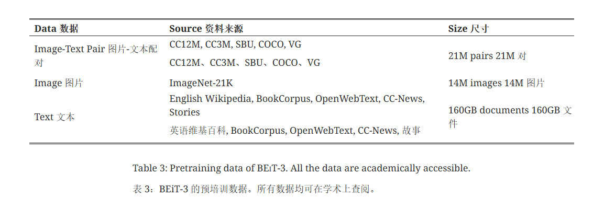

## BEiT-3作用
BEiT-3一种通用的多模态基础模型 BEiT-3，它在视觉和视觉语言任务上都达到了最先进的传输性能.

## BEiT-3模型架构

使用多路转换器（Multiway Transformers）作为骨干模型，对不同的模态进行编码。**每个 Multiway Transformer 模块都由一个共享的自我注意模块和一个用于不同模态的前馈网络池（即模态专家）组成**。我们根据每个输入标记的模态将其路由至专家。在我们的实施过程中，每一层都包含一名视觉专家和一名语言专家。此外，**最上面的三层还有为融合编码器设计的视觉语言专家**。使用模态专家库有助于模型捕捉更多特定模态信息。**共享自我关注模块可以学习不同模态之间的一致性，并实现多模态（如视觉语言）任务的深度融合**。

## 预训练任务
**在单模态（即图像和文本）和多模态数据（即图像-文本对）上通过统一的屏蔽数据建模目标对 BEiT-3 进行预训练**。
在预训练过程中，我们会随机屏蔽一定比例的文本标记或图像片段，然后训练模型来恢复被屏蔽的标记。统一的 "先屏蔽后预测 "任务不仅能学习表征，还能学习不同模态的对齐。
具体来说，文本数据由 SentencePiece 标记器进行标记。图像数据由 BEiT v2 的标记化器进行标记化，以获得离散的视觉标记作为重建目标。
训练中会随机屏蔽了**单模态文本的15%标记**和**图像-文本对中文本的50%标记**。对于图像，我们使用BEiT中的分块屏蔽策略，**屏蔽了40%的图像patch**。

以往的视觉语言模型通常采用多个预训练任务，如图像-文本对比、图像-文本匹配和词块/区域对齐。**研究表明，"先掩码后预测 "任务的预训练批量要小得多**。相比之下，基于对比学习的模型通常需要非常大的批量进行预训练。

