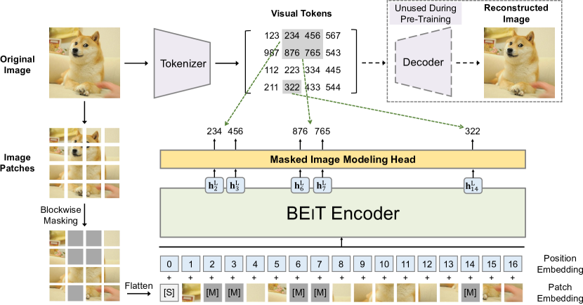
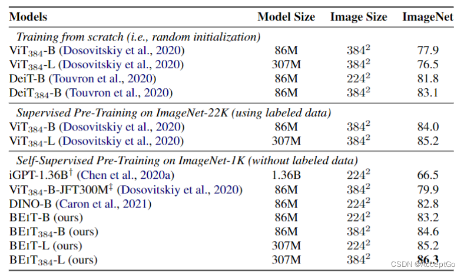

## BEiT作用
BEiT（Bidirectional Encoder Image Transformers）
参考自然语言处理领域开发的BERT方法，BEiT是一个通过遮蔽图像建模任务来预训练视觉变换器。具体来说，预训练过程中，每幅图像都有两个视图，即图像patch和视觉标记（即离散tokens）。首先**将原始图像 "标记化 "为视觉标记。然后，我们随机屏蔽一些图像片段，并将其输入主干变换器。预训练的目的是根据损坏的图像补丁恢复原始视觉标记**。

在对 BEiT 进行预训练后，通过在预训练编码器上添加任务层，可以直接在下游任务中对模型参数进行微调。图像分类和语义分割的实验结果表明，BEiT与之前的预训练方法相比，取得了具有竞争力的结果。

## BEiT模型结构

1. 使用预训练好的dVAE将图像编码成14x14的离散tokens，词汇表大小为8192,**由于卷积的归纳偏置，dVAE的输出的每个token和相应位置的patch通常是相对应的**。
2. 将图片划分为14x14个patch,每个patch大小为16x16,每个patch被编码为一个向量。
3. 随机在原图像上mask某些patch,这些patch使用mask token代替。
4. 对每个mask token,找到相应位置的输出向量，使用一个lm_head分类头，预测其对应的离散token。
5. 计算交叉熵损失，反向传播更新参数。

### 训练设置
BEiT 的网络结构沿用了 ViT-Base的网络结构。使用 12层变换器，其隐藏大小为 768，注意头为12。前馈网络的中间大小为 3072，采用默认的 16×16输入补丁大小。直接借用预训练的图像标记器。视觉标记的词汇量大小为8192。

我们在 ImageNet-1K的训练集上对 BEiT 进行预训练，该训练集包含约1.2M 幅图像。增强策略使用随机大小裁剪、水平翻转和颜色抖动。不使用标签进行自我监督学习。在实验中使用224×224分辨率。因此，输入被分割为14×14个图像片段和相同数量的视觉标记。我们**最多会随机屏蔽 75个图像片段（即大约40%个图像片段）**。

## 实验结果
