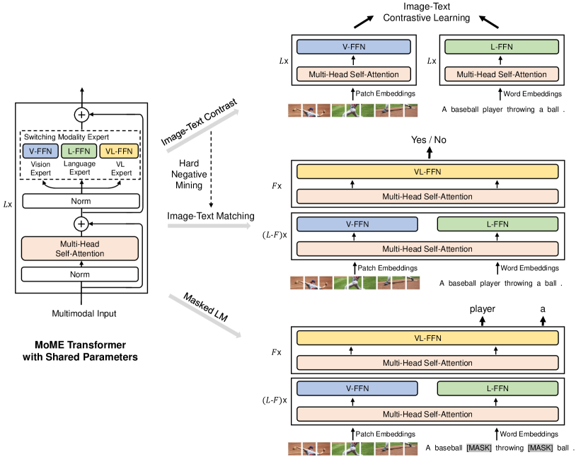
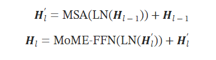
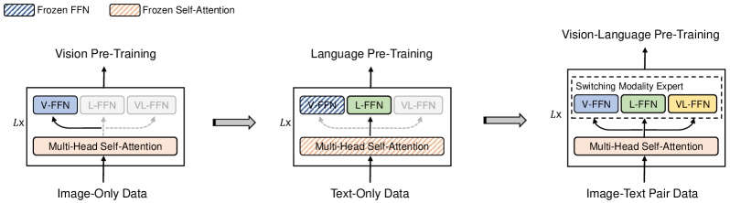

## VLMo作用
VLMo（**V**ision-**L**anguage pretrained **Mo**del）
VLMo是一种**统一的视觉语言预训练模型**，该模型通过模块化变换器网络联合学习双重编码器和融合编码器。
具体来说，作者**引入了混合模式专家（MoME）变换器，其中每个区块都包含一个特定模式专家池和一个共享的自我注意层**。由于 MoME 具有建模灵活性，经过预训练的 VLMo 可作为视觉语言分类任务的融合编码器进行微调，或作为高效图像文本检索的双重编码器使用。

## VLMo结构


###  图像表示法
和ViT一样，将图像分割成patch后再通过线性投影得到嵌入，还会在序列中添加一个可学习的特殊标记 $[I\_CLS]$，通过将补丁嵌入、可学习的一维位置嵌入和图像类型嵌入相加得到图像输入表示.
$H_0^v=[v_{[I\_CLS]},v_{P_1},v_{P_2},...,v_{P_N}]+V_{pos}+V_{type}$


###  文本表示法
按照 BERT [ 10] 的方法，我们用 WordPiece [ 47] 将文本标记为子词单位。在文本序列中添加序列起始标记（$[T_CLS]$）和特殊边界标记（$[T_SEP]$）。文本输入表示是通过将相应的单词嵌入、文本位置嵌入和文本类型嵌入相加得到的。
$H_0^t=[t_{[T\_CLS]},t_{T_1},t_{T_2},...,t_{T_M}]+T_{pos}+T_{type}$

### 图像-文本表示法
将图像和文本输入向量连接起来，形成图像-文本输入表示.
$H_0=[H_0^v;H_0^t]$

## MoME变换器
MoME Transformer 引入了混合模态专家来替代标准 Transformer 的前馈网络。鉴于前一层的输出向量$H_{l-1}$，每个 MoME Transformer 模块都会通过切换到不同的模态专家来捕捉特定模态的信息，并采用跨模态共享的多头自我注意（MSA）来调整视觉和语言内容。LN 是层归一化的简称。


MoME-FFN根据输入向量的模态和变换层的索引，从多个模态专家中选择一个专家来处理输入。具体来说，有三种模态专家：视觉专家（V-FFN）、语言专家（L-FFN）和视觉语言专家（VL-FFN）。
- 如果输入是纯图像或纯文本向量，会使用视觉专家对图像进行编码，使用语言专家对文本进行编码。
- 如果输入由多种模态向量组成，如图像-文本对向量，会在变换器底层使用视觉专家和语言专家对各自的模态向量进行编码。然后在顶层使用视觉语言专家来捕捉更多的模态交互。
- 有了这三种类型的输入向量，就能得到纯图像、纯文本和图像-文本语境化表示。

## 预训练任务

使用分阶段预训练策略，利用大规模纯图像和纯文本语料来改进视觉语言模型。首先在纯图像数据上进行视觉预训练，然后在纯文本数据上进行语言预训练，以学习一般的图像和文本表征。该模型用于初始化视觉语言预训练，以学习视觉和语言信息的对齐。
- 在视觉预训练方面，**在纯图像数据上训练 MoME Transformer 的注意力模块和视觉专家，就像在BEiT中那样**。实践过程中直接利用 BEiT 的预训练参数来初始化注意力模块和视觉专家。
- 在语言预训练方面，会**冻结了注意力模块和视觉专家的参数，并利用掩码语言建模来优化纯文本数据上的语言专家**。
- 在视觉语言预训练方面，**使用图文对比学习（ITC）和图文匹配（ITM）作为预训练任务**，以学习视觉和语言信息的对齐。


## MoME-Block代码
```
class Block(nn.Module):
    def __init__(
        self,
        dim,
        num_heads,
        mlp_ratio=4.0,
        qkv_bias=False,
        qk_scale=None,
        drop=0.0,
        attn_drop=0.0,
        drop_path=0.0,
        act_layer=nn.GELU,
        norm_layer=nn.LayerNorm,
        with_vlffn=False,
        layer_scale_init_values=0.1,
        max_text_len=40,
    ):
        super().__init__()
        self.norm1 = norm_layer(dim)
        self.attn = Attention(
            dim,
            num_heads=num_heads,
            qkv_bias=qkv_bias,
            qk_scale=qk_scale,
            attn_drop=attn_drop,
            proj_drop=drop,
        )
        # NOTE: drop path for stochastic depth, we shall see if this is better than dropout here
        self.drop_path = DropPath(drop_path) if drop_path > 0.0 else nn.Identity()
        self.norm2_text = norm_layer(dim)
        self.norm2_imag = norm_layer(dim)
        mlp_hidden_dim = int(dim * mlp_ratio)
        self.mlp_text = Mlp(
            in_features=dim,
            hidden_features=mlp_hidden_dim,
            act_layer=act_layer,
            drop=drop,
        )
        self.mlp_imag = Mlp(
            in_features=dim,
            hidden_features=mlp_hidden_dim,
            act_layer=act_layer,
            drop=drop,
        )
        self.mlp_vl = None
        if with_vlffn:
            self.mlp_vl = Mlp(
                in_features=dim,
                hidden_features=mlp_hidden_dim,
                act_layer=act_layer,
                drop=drop,
            )
            self.norm2_vl = norm_layer(dim)
        
        self.gamma_1 = \
            nn.Parameter(layer_scale_init_values * torch.ones((dim)),requires_grad=True) \
            if layer_scale_init_values is not None else 1.0
        self.gamma_2 = \
            nn.Parameter(layer_scale_init_values * torch.ones((dim)),requires_grad=True) \
            if layer_scale_init_values is not None else 1.0

        self.max_text_len = max_text_len

    def forward(self, x, mask=None, modality_type=None, relative_position_bias=None):
        x = x + self.drop_path(self.gamma_1 * self.attn(self.norm1(x), mask=mask, relative_position_bias=relative_position_bias))

        if modality_type == "image":
            x = x + self.drop_path(self.gamma_2 * self.mlp_imag(self.norm2_imag(x)))
        elif modality_type == "text":
            x = x + self.drop_path(self.gamma_2 * self.mlp_text(self.norm2_text(x)))
        else:
            if self.mlp_vl is None:
                x_text = x[:, : self.max_text_len]
                x_imag = x[:, self.max_text_len :]
                x_text = x_text + self.drop_path(self.gamma_2 * self.mlp_text(self.norm2_text(x_text)))
                x_imag = x_imag + self.drop_path(self.gamma_2 * self.mlp_imag(self.norm2_imag(x_imag)))
                x = torch.cat([x_text, x_imag], dim=1)
            else:
                x = x + self.drop_path(self.gamma_2 * self.mlp_vl(self.norm2_vl(x)))

        return x


```
  