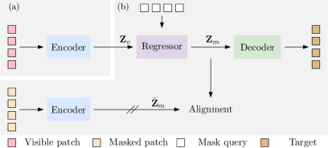
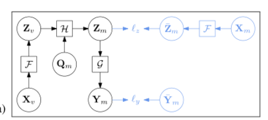
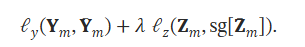
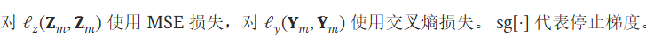
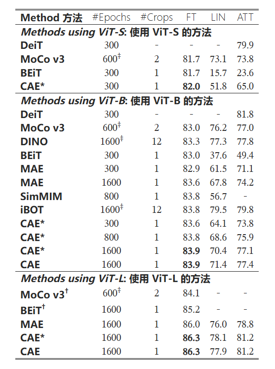

## CAE

## CAE架构

算法流程如下：
1. 将可见patch $X_v$输入到Encoder,得到隐变量 $X_v$;
2. 将隐变量 $Z_v$输入到多个较差注意力堆叠的回归器,并以mask query为较差注意力的query,得到$Z_m$.
3. $Z_m$输入到Decoder,得到重构的patch $Y_m$.
4. 另外把masked patch $X_m$输入到Encoder,得到$Z_m^{'}$

实现：https://github.com/Atten4Vis/CAE/blob/master/models/modeling_cae.py
### 损失函数
损失函数包括重建损失和对齐损失：

### 实验结果

三个指标：线性探测 (LIN)、注意力探测 (ATT) 和微调 (FT) 