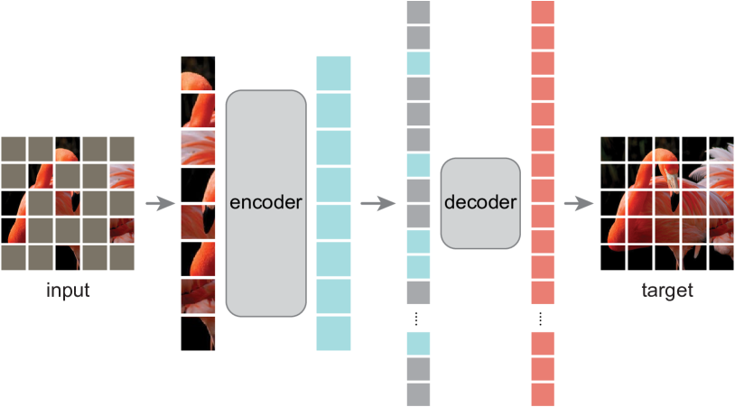
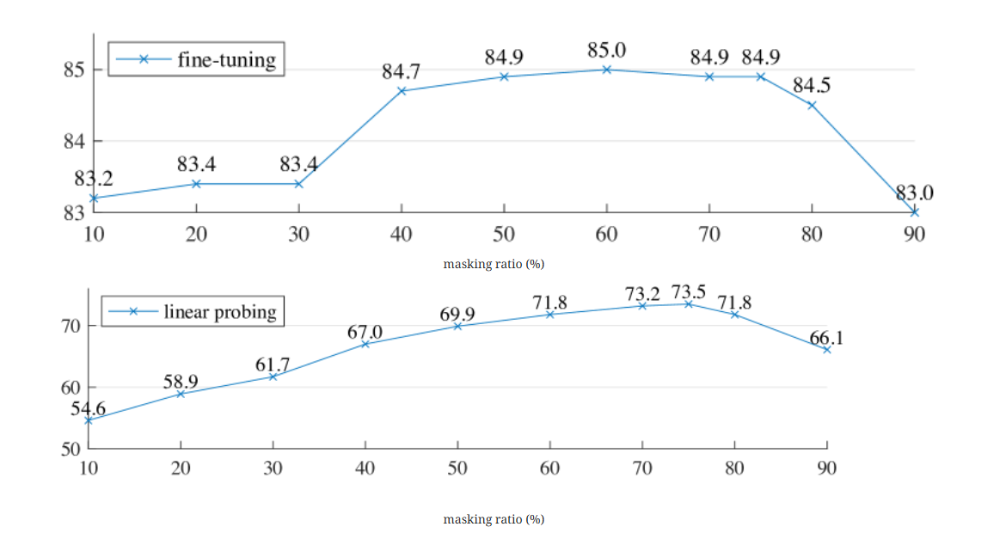
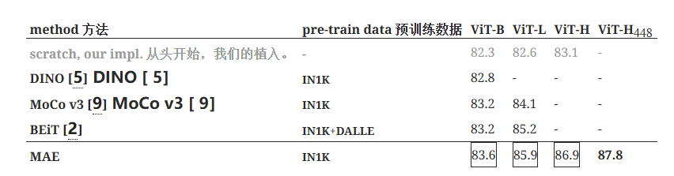

## MAE作用
MAE 方法很简单：**对输入图像的随机片段进行掩蔽，然后重建缺失的像素**。它基于两个核心设计。
首先，使用一种非对称编码器-解码器架构，**其中编码器只对可见斑块子集（无掩码标记）进行编码，而轻量级解码器则根据潜在表示和掩码标记重建原始图像**。
其次，研究发现，**对输入图像的高比例（例如 75%）进行掩码**会产生非同一般的、有意义的自我监督任务。

将这两种设计结合起来，就能高效地训练大型模型：能够同时加快了训练速度（3×或更多）并提高了准确性。
**这种可扩展方法允许学习具有良好泛化能力的大容量模型**：例如，在仅使用 ImageNet-1K 数据的方法中，Vanilla ViT-Huge 模型的准确率最高（87.8%）。在下游任务中的转移性能优于监督预训练，并显示出良好的扩展性。

## MAE架构

### 1.Masking
按照 ViT的方法，将图像划分为规则的非重叠patch。然后，我们对其中的一部分进行采样，并屏蔽（即去除）剩余的部分。我们的采样策略简单明了：**按照均匀分布随机采样**。我们称之为 "随机抽样"。

- 采用**高遮蔽率**的随机采样在很大程度上**消除了冗余**，从而创建了一个无法通过从可见的邻近patch进行外推来轻松解决的任务。
- **均匀分布防止了潜在的中心偏差**（即图像中心附近有更多被遮挡的斑块）。
- 最后，**高度稀疏的输入为设计高效的编码器创造了机**会。

### 2.MAE encoder
编码器是一个ViT，但只适用于**可见的、未遮挡的patch**。与标准 ViT 一样，我们的编码器也是通过线性投影嵌入补丁，并添加位置嵌入，然后通过一系列变换器块处理生成的集合。
不过，MAE encoder只对全集的一小部分（如 25%）进行处理。我们会**移除掩码补丁**，不使用掩码标记。**这样，我们就可以只用一小部分计算和内存来训练非常大的编码器**。全集由一个轻量级解码器处理.

### 3.MAE decoder
MAE 解码器的输入是一整套标记，包括 已编码的可见斑块和掩码标记.**每个掩码标记都是一个共享的、经过学习的向量**，用于指示需要预测的缺失补丁的存在。并**将位置嵌入添加到这个完整集合中的所有标记中**；
MAE 解码器仅在预训练期间用于执行图像重建任务（只有编码器用于生成用于识别的图像表征）。因此，**解码器结构的设计可以灵活地独立于编码器的设计**。可以使用非常小的解码器，比编码器更窄更浅。例如，实验中使用默认解码器与编码器相比，每个标记的计算量为<10%。通过这种非对称设计，**全套标记只由轻量级解码器处理，从而大大减少了预训练时间**。

### 损失函数
MAE通过预测每个遮蔽补丁的像素值来重建输入。**解码器输出中的每个元素都是代表一个补丁的像素值向量。解码器的最后一层是线性投影，其输出通道数等于一个补丁中像素值的数量**。解码器的输出经过重塑后形成重建图像。MAE损失函数计算的是像素空间中重建图像和原始图像之间的均方误差 (MSE)，且只在遮蔽斑块上计算损失。

作者还研究了一种变体，其重建目标是**每个屏蔽斑块的归一化像素值**。具体来说，先计算了一个patch中所有像素的平均值和标准偏差，并用它们对该patch进行归一化处理。**实验表明，使用归一化像素作为重建目标可以提高表示质量**。

## 实验结果

对于线性探测，精确度随着掩蔽比率的增加而稳步上升，直到最佳点75%。对于微调，结果对比率的敏感度较低，广泛的屏蔽比率（40%-80%）都能很好地发挥作用。

与之前在 ImageNet-1K 上的结果比较。预训练数据是 ImageNet-1K 训练集。
