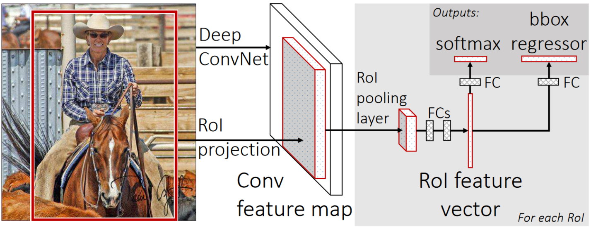
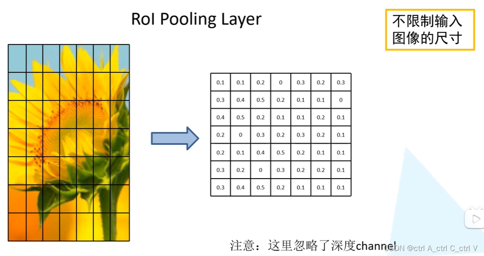
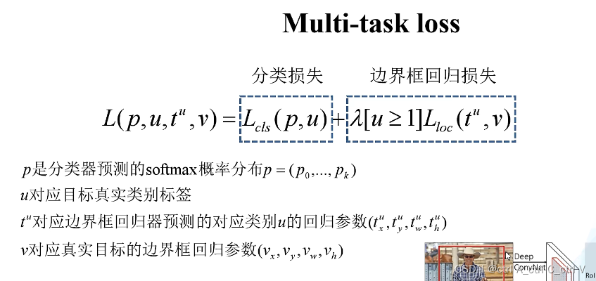

## Fast R-CNN
Fast R-CNN为了解决R-CNN和SPPnet的缺点，拥有以下特点：
- 更高的检测精度（mAP衡量）
- 单阶段训练
- 训练可以更新所有的网络权重（SPPnet难以更新卷积层的权重）
- 不需要磁盘存储特征

## Fast R-CNN网络结构

（1）一张图像生成1K~2K个候选区域(使用Selective Search算法，简称SS算法)，我们将某个候选区域称为ROI(Region of Interest)。

（2）将图像输入网络得到相应的特征图，将SS算法生成的候选框投影到特征图上获得相应的特征矩阵。

（3）将每个特征矩阵通过 **ROI pooling** 层缩放到7×7大小的特征图,展平后送入全连接层，得到特征向量。

（4）将特征向量输入两个全连接层，一个用于分类，一个用于回归。

（5）将分类结果和回归结果分别与SS算法生成的候选框进行运算，得到最终的检测框和类别。

### ROI pooling

将图片划分成固定数量(7*7)的区域，对每个区域进行全局池化，这样得到的输出就是7*7大小的特征图。

### 损失函数

