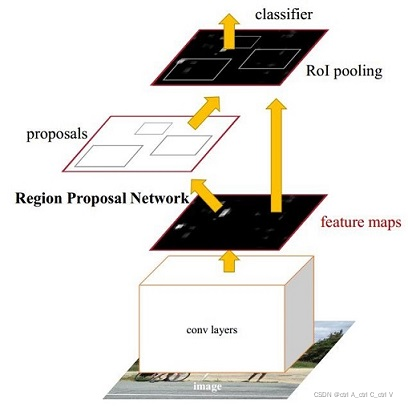

## Faster R-CNN作用

在Fast R-CNN中，用SS算法提取一张图片的候选框区域大约需要2s，而完成整个CNN则只需要0.32s，因此**Fast RCNN 计算速度的瓶颈是Region proposal**。

Faster R-CNN通过引入**Region Proposal Network**(RPN)来代替Fast R-CNN中的SS算法，RPN是一个全卷积网络，用于生成候选区域。RPN的输入是CNN的某一层的特征图，输出是每个位置上是否有物体的概率以及物体的边界框。RPN的输出可以用于生成候选区域，然后这些候选区域可以用于后续的物体检测。

## Faster R-CNN结构
Faster RCNN = RPN + Fast RCNN
RPN 是指 Region Proposal Network，**建议区域生成网络**。 Faster RCNN 中用 RPN 来代替了 Fast RCNN 中的SS算法。

算法流程：

（1）将图像输入CNN网络得到相应的特征图。

（2）使用RPN网络生成候选框，将RPN生成的候选框投影到特征图上获得ROI区域的特征矩阵。

（3）将每个ROI区域的特征矩阵通过 ROI pooling 层缩放到7×7大小的特征图，接着将特征图展平为vector，之后通过一系列全连接层得到预测结果。

### RPN网络

输入图片经过卷积、池化操作之后得到的抽象特征被RPN网络和检测网络共享，对于RPN网络，其首先将检测得到的特征图进行以下处理：
1. 以每个像素为中心设置k个锚框,对每个锚框区域进行以下操作
2. 使用3*3卷积核将特征图进行降维，得到输出通道数为256的特征图。
3. 使用两个1*1卷积核，分别得到两个输出通道数为2k和4k的特征图，分别用于预测锚框的物体概率和物体边界框。

#### 锚框设置
每个anchor的面积和长宽比：

