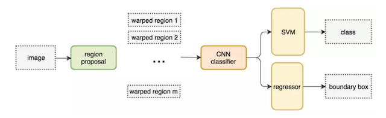
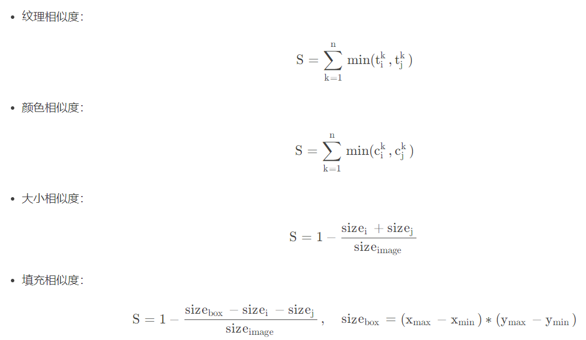
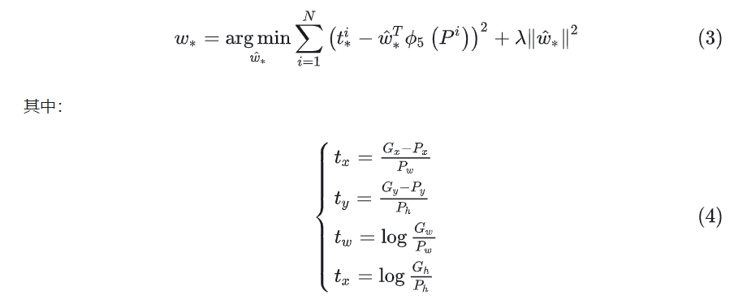

## R-CNN 作用
R-CNN是以深度神经网络为基础的物体检测的模型 ，R-CNN在当时以优异的性能令世人瞩目，以R-CNN为基点，后续的SPPNet、Fast R-CNN、Faster R-CNN模型都是照着这个物体检测思路。

## R-CNN架构

步骤：
1. 输入一张图片，使用**selective search**算法从图片中提取2000个**候选区域(region proposal)**
2. 将每个候选区域**缩放到固定尺寸**(227*227)，输入到AlexNet中，得到特征图,并提取特征向量，2000个建议框的CNN特征组合成网络AlexNet最终输出：2000×4096维矩阵。
3. 对每个特征图**使用SVM进行分类**
4. 分别对2000×20维矩阵中进行**非极大值抑制**（NMS:non-maximum suppression）剔除重叠建议框，得到与目标物体最高的一些建议框。
5. **使用回归器对候选区域进行回归，得到物体精确位置**

### selective search算法
  选择搜索算法的思路很简单，就是输入一个图像，然后通过一些图像分割算法将其分割为很多个小块，这些小块组成一个集合R。**在R中对所有相邻的块求相似度，得到新的集合S。对集合S中相似度最高的两个块R1， R2进行合并可以得到新的块R_new，加入R中，同时删除S中所有与R1或R2有关的相似度，然后计算R_new和所有相邻区域的相似度，加入S**。如此重复迭代计算，直到集合S中不再包含任何元素即可。

伪代码：
```
function selective_search(image):
	R = Felzenszwalb(image) # 基于图的图像分割算法，将图像划分为小块
	S = {} # 用于存储相似度的集合
	for R_1, R_2 in Neighbor(R, R):
		S = S.add(Similarity(R_1, R_2)) # 计算相邻区域相似度，存入集合S
	while S is not Empty:
		R_1, R_2, S_12 = Max_Similarity(S) # 查找出相似度最高的两个区域
		R_new = Merge(R_1, R_2) # 合并R_1，R_2
		S = Remove_Similarity_About(S, R_1) # 删除与R_1有关的相似度
		S = Remove_Similarity_About(S, R_2) # 删除与R_2有关的相似度
		for R_new, R_i in Neighbor(R_new, R):
			S = S.add(Similarity(R_new, R_i)) # 计算R_new与其相邻的区域的相似度并存入S
		R = R.add(R_new)
	return R
```
图像区域相似度的衡量主要考虑四个方面：


### NMS
非极大值抑制（NMS:non-maximum suppression）是目标检测算法中常用的一种后处理技巧，其目的是为了去除冗余的检测框，得到最佳的目标检测框。

**NMS算法步骤：**
1. 对所有检测框按照得分从高到低排序；
2. 选择得分最高的检测框，将其保留，并从列表中删除；
3. 计算所有剩余检测框与当前最高得分检测框的IOU，并删除所有IOU大于给定阈值的检测框；
4. 重复步骤2和3，直到列表为空。

### bbox regressor
回归用于修正筛选后的候选区域，使之回归于ground-truth，默认认为这两个框之间是线性关系，因为在最后筛选出来的候选区域和ground-truth很接近了.

详细解释：https://zhuanlan.zhihu.com/p/76603583

回归目标公式：



