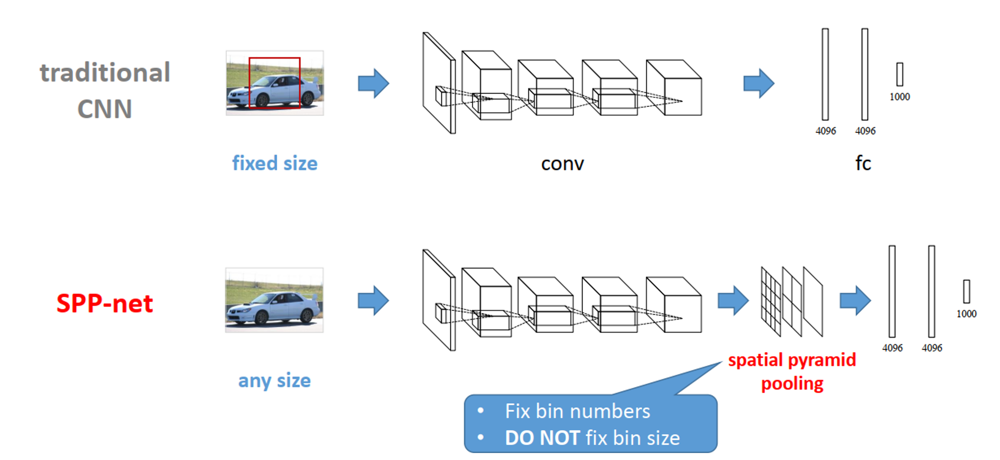
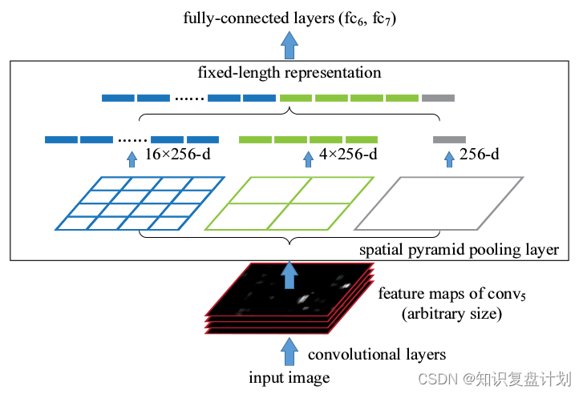
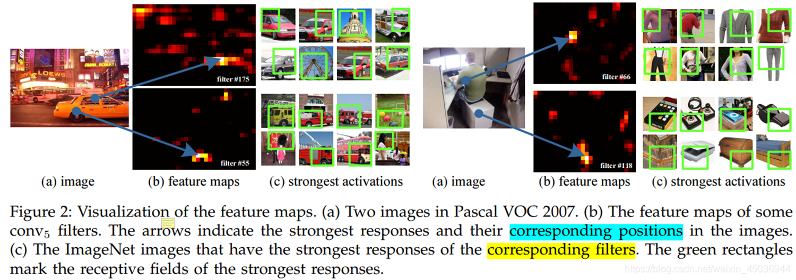
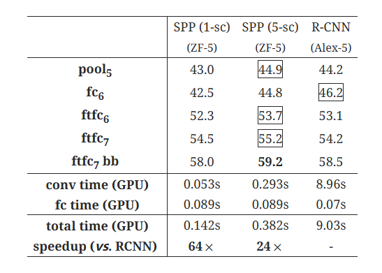
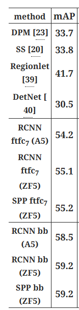

## SPP-Net作用
1.**卷积神经网络的全连接层需要固定输入的尺寸，而Selective search所得到的候选区域存在尺寸上的差异**，无法直接输入到卷积神经网络中实现区域的特征提取，因此RCNN先将候选区缩放至指定大小随后再输入到模型中进行特征提取。无论是通过区域裁剪还是缩放来实现区域大小的固定，其实都是一种次优的操作，**直接对候选框进行crop或者warp操作，会使图像出现失真**。
2.RCNN使用Selective Search从图像中获取候选区域，然后依次将候选区域输入到卷积神经网络中进行图像特征提取，如果有2000个候选区域，则**需要进行2000次独立的特征提取过程**。然后，这2000个候选区域是存在一定程度的重叠的，所以如此设计会**导致大量的冗余计算**。

## SPP-Net结构
CNN一般都含有卷积部分和全连接部分，其中，**卷积层不需要固定尺寸的图像，而全连接层是需要固定大小的输入**。

**SPP Net在最后一个卷积层后，接入了金字塔池化层，保证传到下一层全连接层的输入固定**。

### Spatial Pyramid Pooling
- 以不同网格提取特征，分别是 4×4，2×2，1×1
- 将这三张网格放到feature map上，就可以得到16+4+1=21种不同的块(Spatial bins)
- 对这21个块应用max pooling，每个块就提取出一个特征值，这样就组成了21维特征向量，再设置每个块输出通道数为256，故输出特征向量长度为21*256

### 原始图像中的ROI如何映射到特征图

作者发现,卷积后对应的位置并不会发生改变，每个卷积层会匹配响应的区域。
这样在目标检测使可以根据特征图画出该物体的位置。

## 结果

速度大幅提高，结果相近。