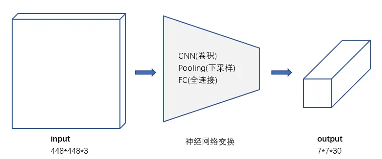
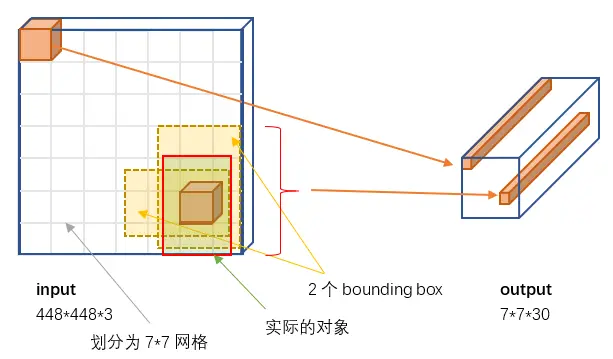
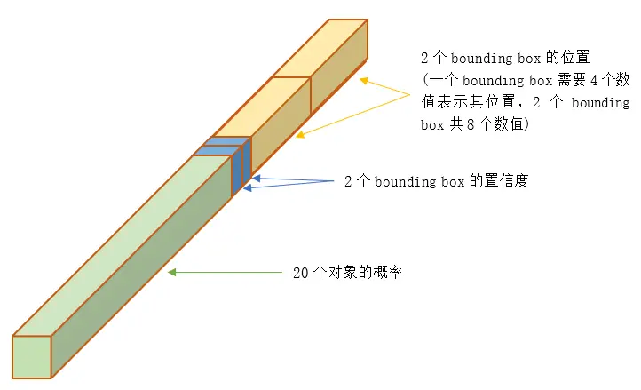
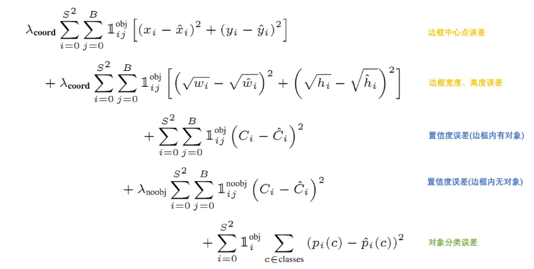

## YOLO-1 作用
从R-CNN到Faster R-CNN一直采用的思路是proposal+分类 （proposal 提供位置信息， 分类提供类别信息）精度已经很高，但由于two-stage（proposal耗费时间过多）处理速度不行达不到real-time效果。
YOLO提供了另一种更为直接的思路： 直接在输出层回归bounding box的位置和bounding box所属的类别(整张图作为网络的输入，把 Object Detection 的问题转化成一个 Regression 问题)。

## YOLO-1 结构

模型要求输入图像大小为448\*448，根据YOLO的设计，输入图像被划分为 7\*7 的网格（grid），输出张量中的 7\*7 就对应着输入图像的 7\*7 网格。或者我们把 7\*7\*30 的张量看作 7\*7=49个30维的向量，也就是输入图像中的每个网格对应输出一个30维的向量。

每个30维向量中只有一组（20个）对象分类的概率，也就只能预测出一个对象。所以输出的 7*7=49个30维向量，**最多表示出49个对象**。

7\*7网格，每个网格2个bounding box，对448\*448输入图像来说覆盖粒度有点粗。我们也可以设置更多的网格以及更多的bounding box。设网格数量为 S*S，每个网格产生B个边框，网络支持识别C个不同的对象。这时，输出的向量长度为：
$$C+B*(4+1)$$
整个输出的tensor就是：
$$S*S*(C+B*(4+1))$$

## 损失函数

其中：
$$
\begin{aligned}
\lambda_{coord} & =5 & \lambda_{noobj} & =0.5 \\
\end{aligned}
$$

## 预测
训练好的YOLO网络，输入一张图片，将输出一个 7\*7\*30 的张量（tensor）来表示图片中所有网格包含的对象（概率）以及该对象可能的2个位置（bounding box）和可信程度（置信度）。
为了从中提取出最有可能的那些对象和位置，YOLO采用NMS（Non-maximal suppression，非极大值抑制）算法。
