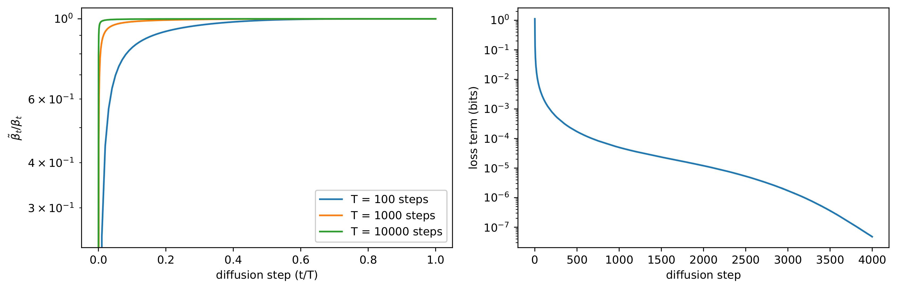
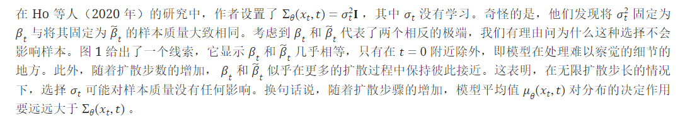
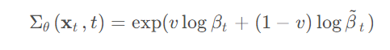
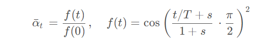
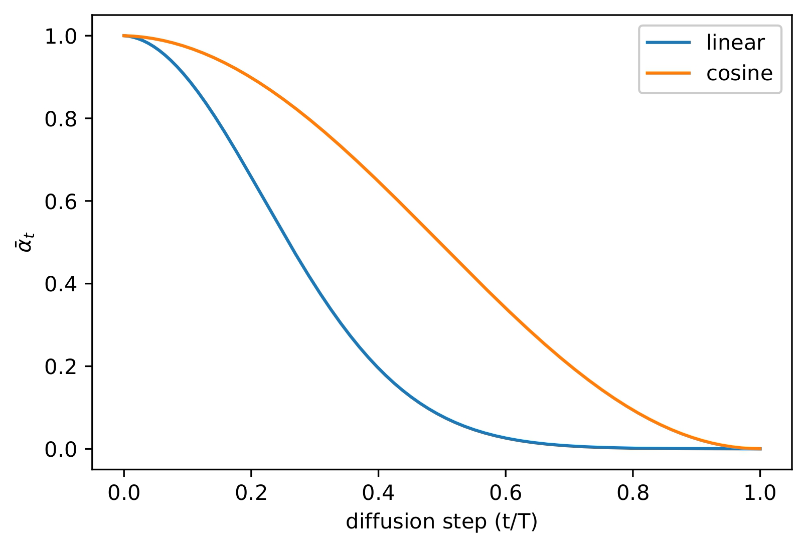
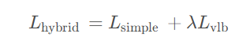
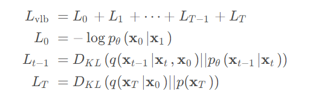
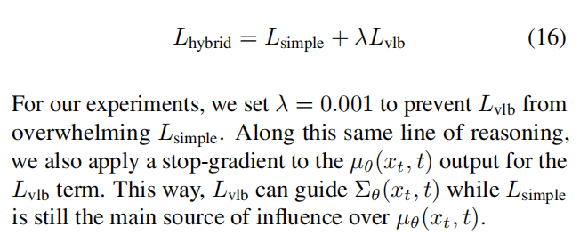
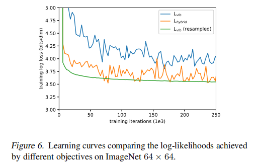
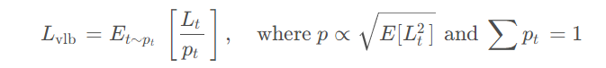

## Improved DDPM作用
尽管 DDPM 在 FID 和 Inception Score 上获得很很好的效果，但在 Log-likelihood 上没有得到很高的得分。

Log-likelihood 也是生成式任务上一个很重要的衡量指标，一般认为优化 Log-likelihood 能够让生成式模型捕捉数据分布的整体信息。此外，最近的研究表明，对数似然的微小改进也会对样本质量和学习特征表示产生巨大影响。因此，探索为什么 DDPM 在这一指标上似乎表现不佳是很重要的，因为这可能暗示着一个根本性的缺陷，如模式覆盖率低。

## Improved DDPM方法
Improved DDPM 主要是针对 DDPM 的训练过程进行改进，主要从两个方面进行改进：

- 不使用 DDPM 原有的固定方差，而是使用**可学习的方差**；
- 改进了加噪过程，使用**余弦形式的 Scheduler**，而不是线性 Scheduler。

### 可学习的方差

**在无限扩散步长的情况下，选择方差可能对样本质量没有任何影响**。换句话说，随着扩散步骤的增加，模型平均值对分布的决定作用要远远大于方差。

虽然上述论证表明，为了保证样本质量，固定方差是一个合理的选择，但这并没有说明对数似然的问题。事实上，图 2 显示，**扩散过程的前几步对变异下限的影响最大**。因此，我们似乎可以通过更好地选择方差来提高对数概率。

既然要选择一个可学习的方差，那么现在的问题就变成了应该如何选取一个合适的方差。这个工作的作者认为因为方差的变化范围比较小，不太容易用神经网络进行学习，所以实际上使用的方差是对$\beta_t$和$\tilde{\beta}_t$进行插值的结果：

### Cosine Noise Schedule
本文的作者发现线性的$\beta_t$对于高分辨率图像效果不错，但对于低分辨率的图像表现不佳。在之前的文章中我们提到过，在 DDPM 加噪的时候$\beta_t$是从一个比较小的数值逐渐增加到比较大的数值的，因为**如果最开始的时候加入很大的噪声，会严重破坏图像信息，不利于图像的学习**。在这里应该也是相同的道理，因为低分辨率图像包含的信息本身就不多，虽然一开始使用了比较小4的$\beta_t$，但线性的 schedule 对于这些低分辨率图像来说还是加噪比较快。

作者把方差用一种 cosine 的形式定义，不过并不是直接定义$\beta_t$，而是定义$\bar{\alpha}_t$ 

这个 schedule 在$t=0$和$t = T$附近都变化比较小，而在中间有一个接近于线性的下降过程，同时可以发现 cosine schedule 比 linear schedule **对信息的破坏更慢**。这也印证了我们在前边提到的理论：在扩散开始的时候更加缓慢地加噪，可以得到更好的训练效果。除此之外设计这个 schedule 的时候作者也有一些比较细节的考虑，比如选取一个比较小的偏移量 $s=8\times10^{-3}$，防止$\beta_t$在$t=0$附近过小，并且将$\beta_t$ 裁剪到 0.999来防止$t=T$ 附近出现奇异点。

### 模型训练
#### 损失函数

#### 重要性采样

作者也表示最开始本来想直接优化$L_\mathrm{vlb}$ ，但是后来发现$L_\mathrm{vlb}$很难优化。作者分析认为$L_\mathrm{vlb}$的梯度比$L_\mathrm{hybrid}$更加 noisy，这是因为**不同时间步的 VLB 损失大小不一**（也就是上边那个损失曲线），均匀采样时间步 t tt 会引入比较多的噪音。为了解决这个问题，作者引入了一个重要性采样：

**在训练的时候不同的时间步是根据损失的权重采样出来的，并且最后在计算损失的时候，不同时间步对应的损失也都乘以了相应的权重**。同时，根据论文中的描述，每个时间步都存储了 10 个历史的损失，将损失作为权重，并且在每个时间步都存储 10 项损失之前，采样是均匀采样。

