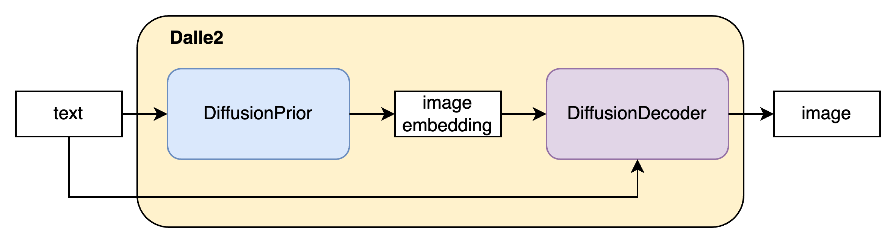
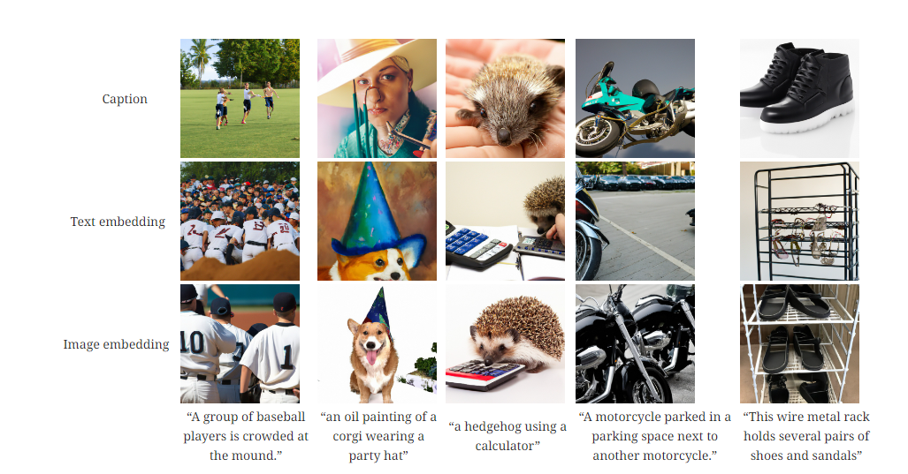
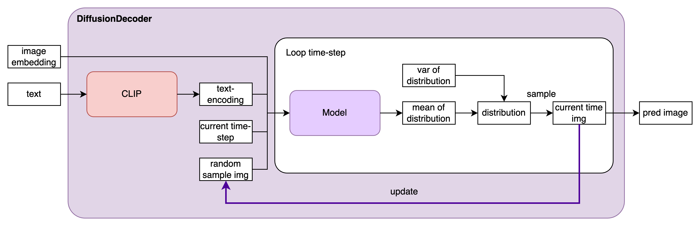

## dalle-2作用
OpenAI结合CLIP与diffusion model提出了一个二阶段的文本生成图片范式Dalle2，能够更精细的从语义层面控制图片的生成效果。得益于其训练范式，Dalle2的图片生成的质量不弱于GLIDE，但生成器的多样性有明显提升。

## dalle-2结构

### DiffusionPrior

直接使用Text embedding作为输入得到图像效果较差，因此Dalle2引入了DiffusionPrior，通过将Text embedding和Image embedding进行匹配，使得Text embedding能够更好的指导图像生成。

使用因果注意掩码对一个仅用于解码器的变换器进行训练，该变换器的序列依次包括：**编码文本、CLIP 文本嵌入、扩散时间步的嵌入、噪声 CLIP 图像嵌入以及最终嵌入**，变换器的输出用于预测未噪声 CLIP 图像嵌入。
和Diffusion Model模型一样，通过$x_t$可以推出$x_{t-1}$的分布了，在对$x_{t-1}$的分布经过正太分布重采样技巧，就可以一步步迭代往前推，得到最终的特征向量了。

### Diffusion Decoder

Decode部分也是个diffusion model。其主要作用是根据image embedding和文本embedding进行图像重建。这里值得强调的是，之前基于文本生成图片的任务只有文本向量作为条件（condition）。与之不同的是，**Dalle2生成图片的条件有两个：其一是文本向量；其二是基于Prior模块估计的图片向量**，这个操作使得它的生成效果更逼真、稳定。

#### tricks
##### 如何实现classifier-free guidance
dalle2的实现是每次随机mask掉10%的CLIP embedding，并且每次随机丢弃50%的text caption。

##### 如何获得更高分辨率的生成图像
Dalle2采用了**渐进式的生成方法**。Dalle2训练了两个diffusion upsampler模型，第一个模型从$64 \times 64$采样到$256 \times 256$,第二个进一步采样到$ 1024 \times 1024$。为了提升upsamper的稳健性，第一个上采样阶段用了高斯模糊；第二个上采样阶段用了多种BSR degradation操作.

