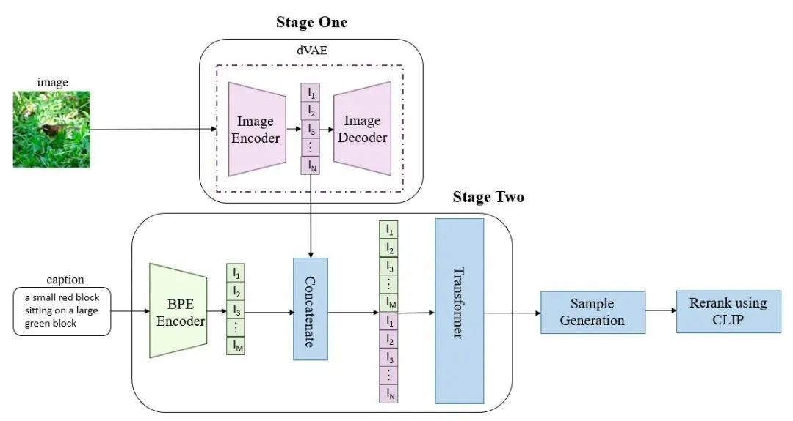
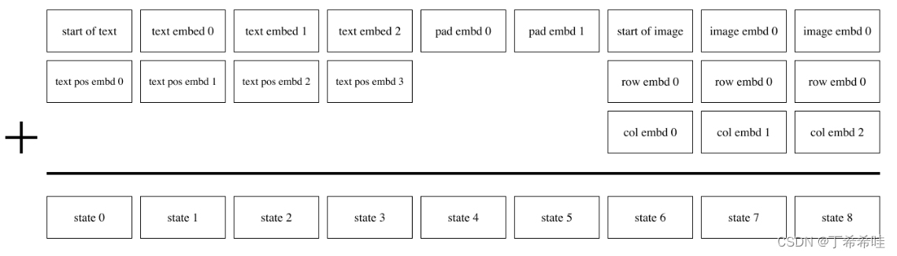
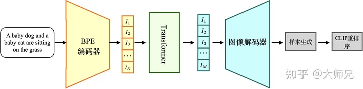

## dalle作用
dalle基于transformer,将文本和图像标记自回归建模为单个数据流,
凭借足够的数据和规模，当以零样本方式评估时，与以前的特定领域模型具有竞争力。

## dalle结构

### Stage One
训练dVAE将原始图像离散化。
### Stage Two
训练transformer:
阶段2的输入是拼接的文本特征和图像特征以及各自的位置编码等信息。

DALL-E使用的Transformer是稀疏Transformer，它的特点是只关注Top-k个贡献最大的特征的状态，因此比普通的Transformer更能关注重要的特征。DALL-E的Transformer有64个自注意力层，每个层的头数是62，每个注意力头的维度是64。

## 图像生成

图像生成过程：
1. 将输入文本编码成特征向量，然将特征向量送入到自回归的 Transformer中生成图像的token
2. 将图像的token送入到dVAE的解码器中得到生成图像
3. 通过CLIP对生成样本进行评估，得到最终的生成结果

