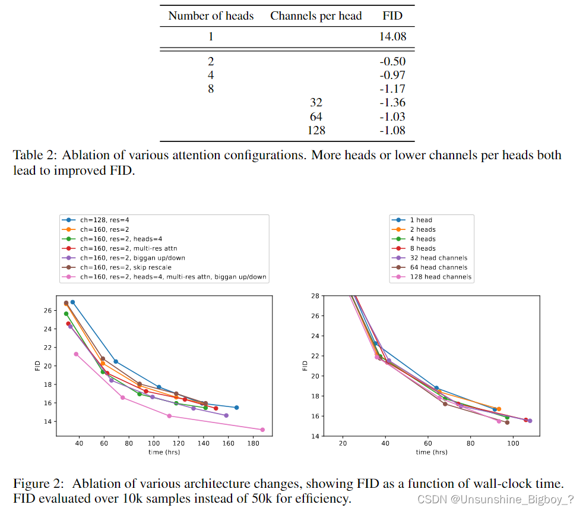
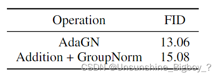
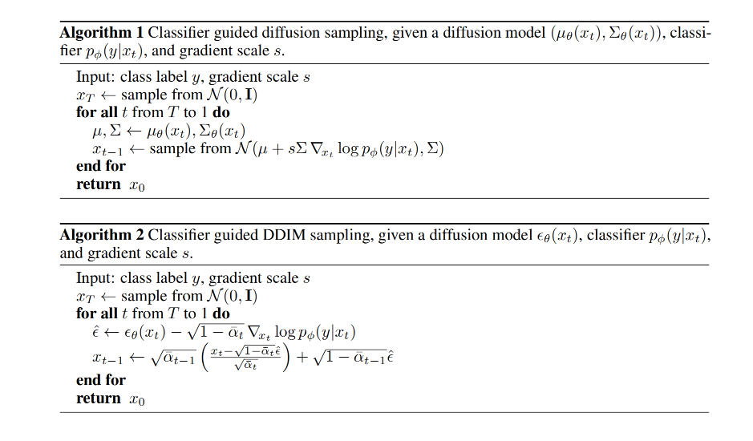
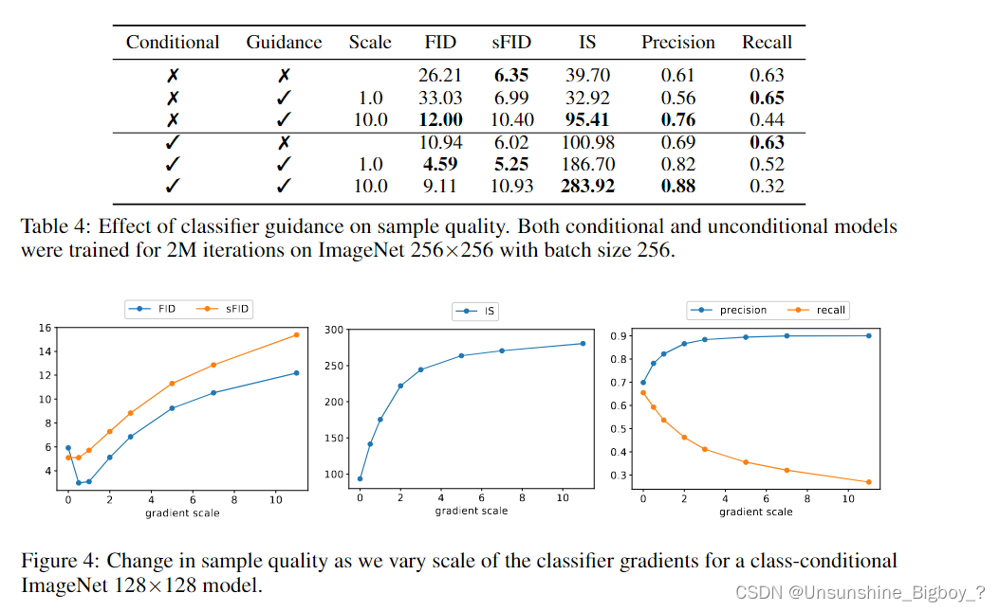
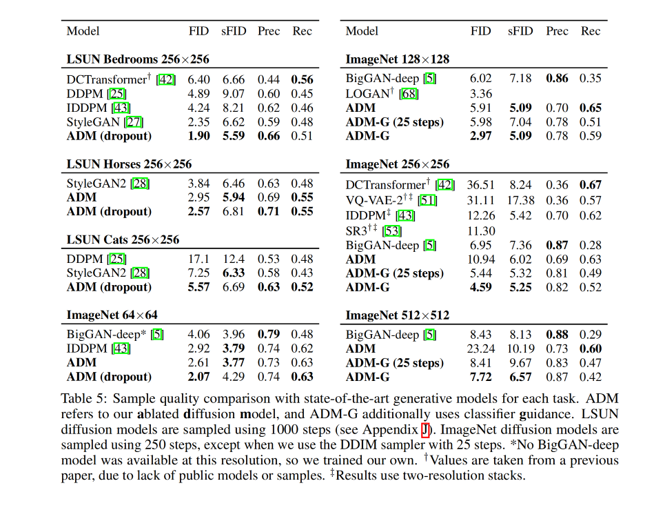
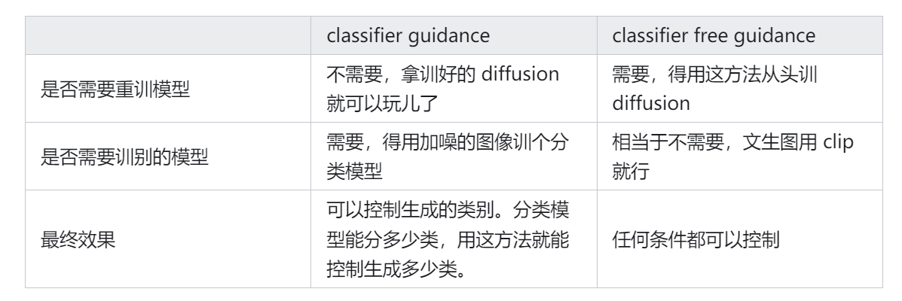
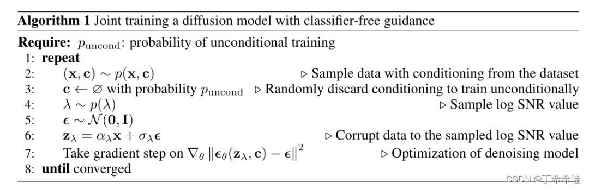
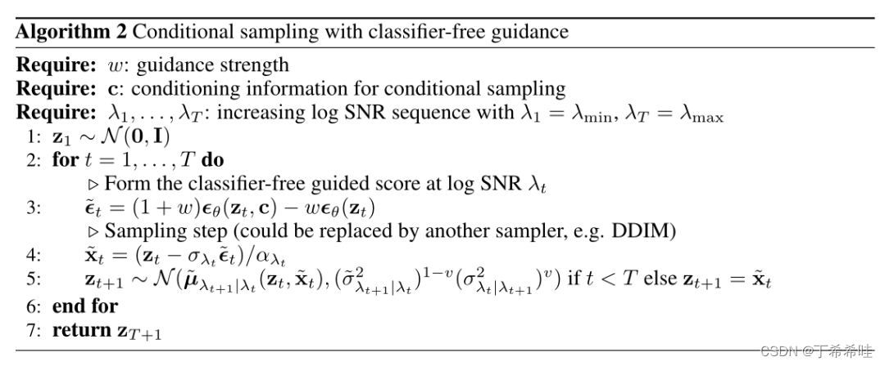

## guided-diffusion作用
- 在本文章之前，扩散模型生成的图片已经非常逼真了，但是 inception score（IS FID等）不如GAN，如何提供一些人为指导来帮助模型采样和学习，提高分数和采样速度就是本文的出发点
- 作者引入了 classifier guidance 模式，将扩散模型变成了 class-conditional 任务，使用分类梯度来指导扩散模型的生成，平衡了多样性和保真性，降低了扩散模型的采样时间，同时能提高高分辨率情况下的采样效果

## guided-diffusion原理
作者假设扩散模型和GANs之间的差距源于至少两个因素:
- 首先，最近的GAN文献中使用的模型架构已经被大量探索和改进;
- 第二，GANs能够**在多样性和保真度之间进行权衡**，产生高质量的样本，但不能覆盖整个分布。

故作者进行了以下改进：
- 改进模型架构
- 通过设计一个方案来权衡多样性和保真度。
通过这些改进，实现了新的最先进的技术，在几个不同的指标和数据集上超过了GANs。

### 改进模型架构
主要做了如下改动：

①增加模型的深度和宽度，使得模型大小保持相对恒定。

②增加了注意力机制的heads

③使用32×32、16×16和8×8的分辨率进行注意力计算

④使用BigGAN的残差模块进行上采样和下采样

⑤残差连接系数改为$1/\sqrt{2}$

上图所示就是消融实验的部分，通道数更多虽然效果更好，但是时间也会更加长。于是，最后选择的128个基础通道，每个分辨率上两个残差块，多分辨率注意力机制，BigGAN的上下采样，每个head64个通道。

此外还加入了**Adaptive Group Normalization**，在Group Normalization后将时间步长和类别嵌入到每个残差块中，计算方式如下：**AdaGN(h, y) = ys GroupNorm(h) + yb**，h是第一次卷积之后的残差块的中间激活层，y=[ys，yb]是从时间步长和类嵌入的线性投影获得的。

### Classifier Guidance 
**本文方法不用额外训练扩散模型，直接在原有训练好的扩散模型上，通过外部的分类器来引导生成期望的图像**。唯一需要改动的地方其实只有 sampling 过程中的高斯采样的均值，也即采样过程中，**期望噪声图像的采样中心越靠近判别器引导的条件越好**。

通过不同的s可以权衡多样性和保真度。

### 结果

## 对guided-diffusion的改进
### Classifier-Free Guidance

Classifier-Free 方案相当于直接用模型拟合了Classifier Guidance逆扩散过程的$\mu(x_t)+\sigma_t^2\nabla_{x_t}logp(y|x_t)$

#### 训练

#### 采样
