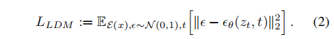
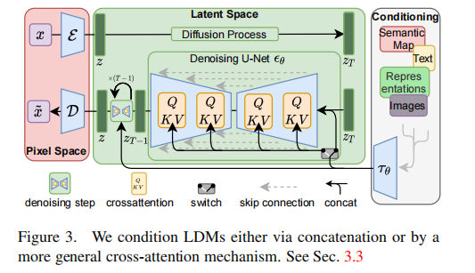
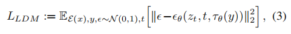
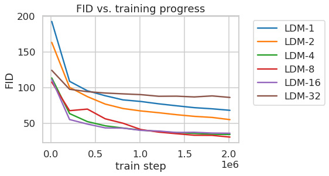
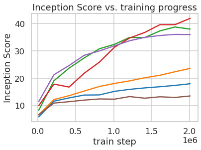
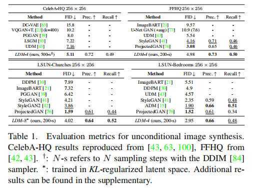

## latent diffusion 作用
基于扩散模型的计算量大的问题，本文作者就思考是否能够在有限的计算资源上训练 DM 模型，同时保持其效果。

比如 VAE 和 Diffusion 结合，可以**先通过 VAE 将原来的高分辨率图转换到低维空间，然后在低维空间上训练扩散模型，之后通过 Decoder 将低维还原到高维空间**。

## latent diffusion 模型结构
### 感知图像压缩
给定一个 RGB 空间的图像 $x \in R^{H \times W \times 3}$：

使用 encoder $\varepsilon$ 将 $x$ 编码到潜在空间$ z=\varepsilon(x)$
使用 decoder $D$从潜在空间中将图像复原，$\tilde{x}=D(z)=D(\varepsilon(x))$
encoder 会把原图下采样$f$倍
为了避免任意的高方差的潜在空间，作者对比了两者不同的正则化方法：

- $KL-reg$：对学习的潜在空间世家标准的 KL 惩罚，类似于 VAE
- $VQ-reg$：在解码器内使用矢量量化层

###  潜在扩散模型(LDM, Latent Diffusion Model)
训练之后可以得到一个**低维的、高效的潜在空间**，该潜在空间中不包括高频的细节信息。

这种低维的空间更适合于基于概率的生成模型，因为其有两个好处：

其一，更关注数据中的重要的语义信息
其二，能够在低维且高效的空间中进行训练

潜在扩散模型的损失如下：

使用 UNet 作为 backbone

### 条件机制

可以使用一个条件去噪自编码器$\epsilon_{\theta}(z_t,t,y)$，并通过输入$y$来控制图像合成过程，$y$可以是文本、语义特征图等.

**作者通过 cross-attention 机制增强了 UNet backbone，将 DM 转换成更灵活的图像生成器。能够适应于学习各种输入模式的 attention-based 模型**。

作者为了能够预处理来自不同模式的输入$y$，引入了一个 **domain-specific encoder $\tau_{\theta}$**，可以将$y$投影到中间表示$\tau_{\theta}(y)$，然后通过 cross-attention 将这些信息引入到 UNet 的中间层。

损失函数：
$τ_θ$（domain-space encoder）和$\epsilon_{\theta}$在这里同时被优化.

## 实验

下采样比例 f为4或8时能得到更好的合成结果。

CelebA-HQ 上达到了 SOTA FID 5.11

